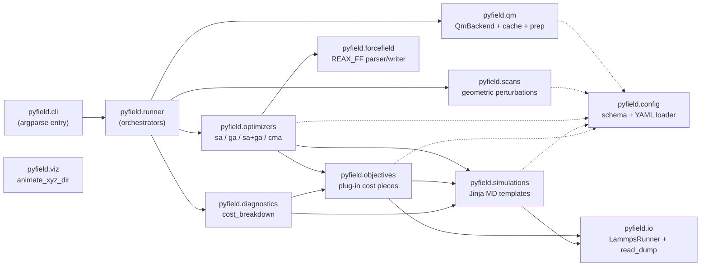
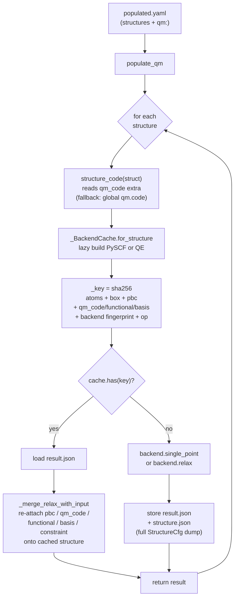
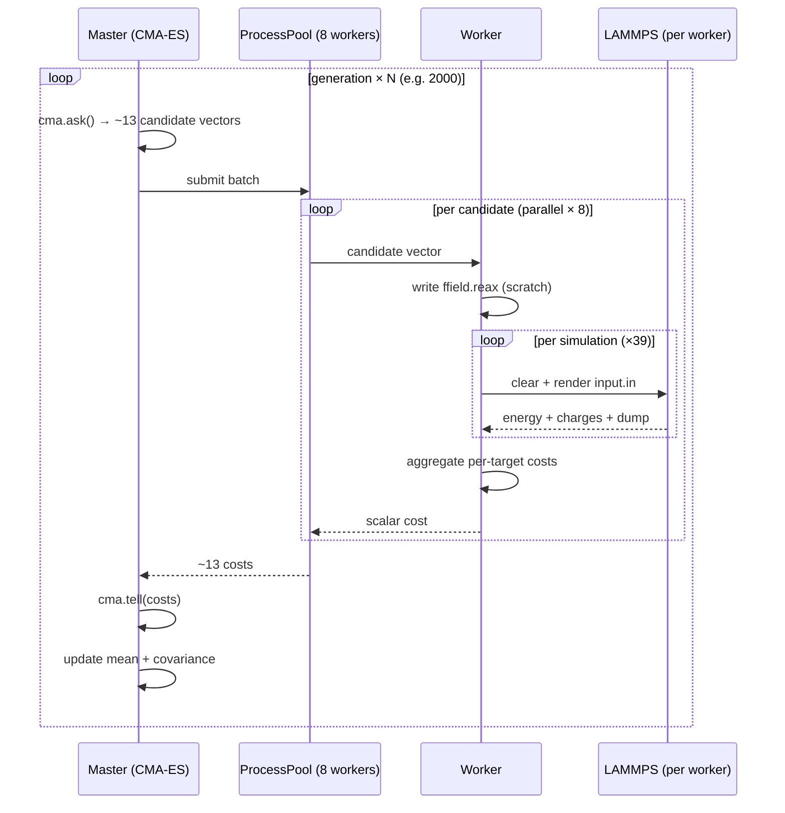

# PyField — Developer Document

## 1. What this project is

**PyField** (a.k.a. *Python-forcefield-optimizer*) is a tool for optimizing classical
molecular-dynamics force fields against quantum-chemistry reference data.

The input is:
- a force-field file (only **ReaxFF** is supported today; written in the standard
  `ffield.reax` block layout: General → Atoms → Bonds → Off-Diagonal → Angles →
  Torsions → H-Bonds);
- a **parameter-selection file** (`params`) that lists which force-field entries
  are free to vary, with `(section, entry, item, delta, min, max)` per line;
- a **training data file** that defines an objective:
  - `ENERGY <weight>` block: signed combinations of structures whose computed
    minimized energies should match a target (e.g. `1*A − 1*B = ΔE_DFT`);
  - `CHARGE <weight>` block: per-atom QEq charges that should match a target;
- an **input structure file** containing one or more `#structure` blocks, each
  with atom count, atom-mass table, box dimensions, atom coordinates and an
  optional `#restrain` block (bond / angle restraints) for constrained
  minimizations.

The output is a tuned `ffield.reax` (`bestFF.reax`) plus per-iteration cost
traces.

> **Planned change.** The training-data file *and* the input-structure file
> — both formats we invented — are being merged into one YAML config. The
> new schema separates *simulations* (minimize, NVT, temperature ramp, …)
> from *targets* (energy combinations, charges, coordination numbers,
> structural match, melting onset, …) so adding a new objective is a
> plug-in instead of a parser change. See **§7 — Proposed direction:
> YAML-driven objectives**.
>
> The **`params` file is *not* part of this change** — its
> `section/entry/item` indexing is dictated by the ReaxFF / LAMMPS file
> layout, not by us.

### Pipeline

The current (post-2026-05-02) pipeline:

```
   user.yaml                                                        rough geometry +
       │                                                            scans block
       ▼
   pyfield qm-relax    ─► PySCF geom-opt ─► relaxed.yaml            equilibrium coords
       │                                       │                     written into atoms:
       ▼                                       │
   pyfield make-scan    ─► six geometric  ─► scanned.yaml            structures + sims +
       │                  transforms       + xyz snapshots           targets stamped out
       ▼                                       │
   pyfield qm-prep      ─► PySCF single-   ─► populated.yaml         every `from: dft`
       │                  points              │                      slot filled
       ▼                                       ▼
   pyfield run         ──► REAX_FF + SA / GA ──► bestFF.reax         FF refit driven by
                          (LAMMPS reaxff +                           the QM-generated
                           qeq/reaxff)                                training set
```

Every intermediate step is content-keyed (SHA-256 over canonical atoms
+ backend fingerprint + op), so repeated runs are no-ops on cache hits
and a small change only re-runs what depends on it.

### Module map (current `pyfield/` package)

| Subpackage / module     | Purpose |
|-------------------------|---------|
| `pyfield.cli`           | `argparse` entry: `run`, `run-legacy`, `qm-prep`, `qm-relax`, `make-scan`. |
| `pyfield.runner`        | Top-level orchestrators each subcommand calls; refuses to run an SA/GA on an unpopulated config. |
| `pyfield.config`        | Pydantic schema + YAML loader; legacy-text → YAML shim under `legacy.py`. |
| `pyfield.forcefield`    | ReaxFF parser / writer (`REAX_FF`) and `ForceField` base shaped for COMB/Tersoff/OPLS to slot in. |
| `pyfield.simulations`   | Jinja-templated backends: `minimize`, `nvt`, `npt`, `single_point`, plus user-template escape hatch (`template:`) under a variable-leakage contract. |
| `pyfield.objectives`    | Plug-in registry of cost-function pieces (`energy_combination`, `charges`, `coordination`, `structural_match`, `rdf_peak`, `forces`, `melting_onset`, `eos`). |
| `pyfield.optimizers`    | `sa`, `ga`, `sa+ga` drivers consuming the objective registry. |
| `pyfield.io`            | `LammpsRunner` (one long-lived `lammps()` reused with `clear`), `read_dump` streaming reader, structure-file writer. |
| `pyfield.qm`            | `QmBackend` interface, content-keyed `QmCache`, `populate_qm` / `relax_structures`, and the PySCF backend MVP. |
| `pyfield.scans`         | `expand_scans` engine + `transforms.py` (six geometric perturbation kinds). Consumed by `pyfield make-scan`. |
| `pyfield.viz`           | `animate_xyz_dir` — pure-matplotlib in-notebook scan animation. |
| `pyfield.diagnostics`   | `cost_breakdown(cfg, ffield_path?)` — runs every required sim once and reports per-sim energies + per-target residuals. Used by the notebook to compare initial vs post-SA FF. |

#### Subpackage call graph

Solid arrows are runtime imports / function calls; dashed arrows are
schema-only dependencies (everyone reads `pyfield.config` types).



#### QM-prep dispatch flow

How `populate_qm` routes a structure to the right backend. The
critical detail is the **per-structure** dispatch via
`structure_code(struct, fallback)` — clusters and PBC bulk can
coexist in the same run.



The merge step is what made the 2026-05-04 cache fix work: legacy
entries didn't store `pbc / qm_code / qm_functional`, so cache hits
silently routed PBC structures through PySCF. `_merge_relax_with_input`
re-attaches the dispatch metadata from the *input* structure on every
hit, regardless of cache vintage.

#### CMA-ES parallel evaluation loop

The optimizer hot path. `cma.ask() → batch eval over a worker pool →
cma.tell()` — repeated `generations` times. The 39-LAMMPS-sims-per-eval
is what dominates wall-clock; QE doesn't run here (it's all cached).



Each worker holds its own long-lived `LammpsRunner` and per-worker
scratch directory (so `*.data / *.in / *.lammpstrj` writes don't
collide). With `optimizer.seed` set the run is bit-identical regardless
of `processors` — every random number is drawn on the master.

## 2. Setup and installation

The hard part of setting up PyField is **LAMMPS with the Python module +
the REAXFF and QEQ packages**. Once that works, the Python deps (`numpy`,
optionally `tensorflow` for `NNOpt.py`) are trivial.

### Recommended path (Linux x86_64 / aarch64, macOS, Windows): the PyPI wheel

```bash
python -m venv .venv && source .venv/bin/activate
pip install 'lammps[mpi]'   # bundles a manylinux MPICH so no system MPI needed
pip install numpy
```

The `lammps[mpi]` extra also installs an `mpich` Python wheel that drops
`libmpi.so.12` into `<venv>/lib/`. The `lammps` `CDLL` loader does **not**
search there by default. Two workable approaches:

1. **Set `LD_LIBRARY_PATH` before launching Python** (works because glibc
   reads it at process start):
   ```bash
   export LD_LIBRARY_PATH="$VIRTUAL_ENV/lib:$LD_LIBRARY_PATH"
   python your_script.py
   ```
2. **Preload `libmpi.so.12` from inside the script** with `RTLD_GLOBAL`,
   *before* importing `lammps` — this is what `pyfield.io.lammps.preload_libmpi`
   does on every CLI entry, so users don't have to remember the env var:
   ```python
   import ctypes, os, sys
   _libmpi = os.path.join(sys.prefix, "lib", "libmpi.so.12")
   if os.path.exists(_libmpi):
       ctypes.CDLL(_libmpi, mode=ctypes.RTLD_GLOBAL)
   from lammps import lammps   # now succeeds
   ```
   Setting `os.environ["LD_LIBRARY_PATH"]` at runtime does **not** work —
   glibc caches the value at process start.

Verify the install + the packages we need:

```bash
python -c "
import ctypes, os, sys
ctypes.CDLL(os.path.join(sys.prefix, 'lib', 'libmpi.so.12'), mode=ctypes.RTLD_GLOBAL)
from lammps import lammps
lmp = lammps()
print('LAMMPS:', lmp.version())
for p in ['REAXFF','QEQ','MOLECULE','MANYBODY','RIGID','KSPACE']:
    print(f'  {p}:', p in lmp.installed_packages)
lmp.close()"
```

You should see all six `True`. If `REAXFF` or `QEQ` is `False`, the wheel is
not usable for this project — fall back to one of the alternatives below.

### Alternatives (only if the wheel doesn't work for you)

| Method | How | When to use |
|---|---|---|
| **conda-forge** | `conda install -c conda-forge lammps` | You already use conda; it ships a separate `lammps` Python package alongside the binary, with most packages enabled. |
| **apt (Ubuntu/Debian)** | `sudo apt install lammps` | Quick, but historically does **not** ship the `lammps` Python module on Ubuntu 20.04/22.04. You'd still need pip or source for the Python side. |
| **Build from source** | `cmake -D PKG_REAXFF=on -D PKG_QEQ=on -D PKG_MOLECULE=on -D BUILD_SHARED_LIBS=on -D BUILD_MPI=on ..` then `make -j && make install-python` | Full control, can pick exactly which packages. Required if you need to patch LAMMPS itself or run on an HPC with a specific MPI. See <https://docs.lammps.org/Build_basics.html>. |

### Smoke test

After installing, confirm the optimizer end-to-end on the bundled
`tests/` data:

```bash
pyfield run tests/cl2.yaml
```

What it does:

1. Loads `tests/cl2.yaml` (validated by the pydantic schema).
2. Renders the bundled `minimize` Jinja template per structure, writes
   data + input files into `tests/runs/cl2_smoke/`, runs LAMMPS through
   a single long-lived `LammpsRunner`, gathers energies + charges.
3. Two SA iterations; each iteration evaluates every registered
   objective (here only `energy_combination`) and Metropolis-accepts.
4. Writes `bestFF.reax` and prints `FINAL cost:`.

Expected output ends with `FINAL cost: 32907.21744068185` (deterministic
because `seed: 0` is set in the YAML). Total wall time is under a second.

Or run the test suite, which exercises the same path plus parser
round-trip, schema validation, snapshot equivalence, and runner reuse:

```bash
pytest -v
```

### Patches that were needed to make the existing code run

When the smoke test was first attempted against LAMMPS 22 Jul 2025
(the version pip currently ships), two breakage points hit:

1. `pair_style reax/c NULL` and `fix qeq/reax …` — `reax/c` was removed
   from LAMMPS in 2021; the supported names are `reaxff` and `qeq/reaxff`.
   Patched in `LAMMPS_Utils.lammps_input_creator`.
2. `lmp.gather_atoms("charge", 1, 1)` — the per-atom property name is now
   `q`. Also the old return only kept the first two charges; now it
   returns the full list. Patched in `LAMMPS_Utils.energy_charge`.

Both fixes are minimal and live in `LAMMPS_Utils.py`. They are listed as
resolved in §4.

### Python dependencies (non-LAMMPS)

Dependencies are declared in `pyproject.toml`. `tensorflow` is only
needed by the unfinished `NNOpt.py` and is *not* in the default install;
add the `[nn]` extra (`pip install -e .[nn]`) only if you are actively
working on `NNOpt`. The legacy top-level `requirements.txt` was removed
in Phase 2.

### QM backend setup (optional)

PySCF (`pip install -e .[qm]`) is the default backend and needs no
extra setup — it ships its own integrals + xc functionals. The other
backends drop in behind the same `QmBackend` interface; today only
**Quantum ESPRESSO** is wired through. Setup mirrors the user-facing
README §"Setting up Quantum ESPRESSO" but is repeated here so a
developer modifying `pyfield/qm/qe_backend.py` doesn't have to chase
it down.

**1. Install QE (provides `pw.x`).**

```bash
sudo apt install quantum-espresso        # Ubuntu / Debian
# or: conda install -c conda-forge qe
# or: build from source (https://www.quantum-espresso.org/)
```

**2. Tell ASE how to invoke it.** ASE's `Espresso` calculator reads
`ESPRESSO_COMMAND` from the environment at *kernel-start time*. There
is no notebook-runtime workaround — `os.environ['…'] = …` after the
kernel is already up only affects child processes you spawn from that
point on, but ASE's `EspressoProfile` snapshots the value during
construction.

```bash
# In the shell that launches python / jupyter:
export ESPRESSO_COMMAND='/usr/bin/mpirun.openmpi -np 8 pw.x'
jupyter lab    # or python …
```

ASE 3.23+'s `EspressoProfile` appends `-in espresso.pwi` itself and
captures stdout/stderr — the env var is **just the launcher prefix**
(no `-in PREFIX.pwi`, no `> PREFIX.pwo`; older ASE docs that include
those will be passed as literal argv to mpirun and break).

Use the **system** OpenMPI launcher (`/usr/bin/mpirun.openmpi`)
explicitly: `pw.x` from `apt install quantum-espresso` links against
`/lib/x86_64-linux-gnu/libmpi.so.40` (OpenMPI), and a venv-installed
`mpirun` is often MPICH/Hydra — incompatible ABIs would either error
out or fork N independent serial processes (no parallelism). `ldd $(which pw.x) | grep mpi`
tells you which MPI flavour QE is linked against, and the `mpirun`
ABI must match.

Pick `-np` to match physical cores (not hyperthreads). On 8 cores the
typical speedup is 5–7× over single-core. Without this env var, ASE
falls back to plain `pw.x` (single-core) — runs still complete on
small cells but compound badly across a scan.

To verify what the running kernel sees:

```python
import os; print(os.environ.get('ESPRESSO_COMMAND'))
```

`None` means single-core. Restart the kernel after exporting.

**3. Pseudopotentials.** SSSP 1.1.2 PBE Efficiency is the
recommended set — well-tested across thousands of compounds.

```bash
mkdir -p ~/qe_pseudos && cd ~/qe_pseudos
curl -fsSL -o SSSP.tar.gz \
  "https://archive.materialscloud.org/api/records/rcyfm-68h65/files/SSSP_1.1.2_PBE_efficiency.tar.gz/content"
tar xzf SSSP.tar.gz && rm SSSP.tar.gz
export ESPRESSO_PSEUDO=~/qe_pseudos
```

PyField reads `ESPRESSO_PSEUDO` (or the YAML `qm.pseudo_dir` key)
when constructing the `EspressoProfile`. Per-element UPF filenames
go in the YAML's `qm.pseudopotentials` map; changing a UPF
invalidates the cache (the filename is folded into
`settings_fingerprint`).

**4. Re-running cached QM after env-var changes.** The QM cache
(`pyfield/qm/cache.py`) keys on the *settings* fingerprint, not the
runtime command. So flipping `ESPRESSO_COMMAND` from single-core to
mpirun does **not** invalidate cached results — same input → same
energy regardless of wall-clock. Wipe `~/.cache/pyfield/qm/<hash>/`
manually only if you suspect a numerical regression.

### Known platform gotchas

- **Windows / WSL**: the `LD_LIBRARY_PATH` trick is Linux-only. On native
  Windows use the PyPI wheel and ensure the bundled MS-MPI runtime is
  found; in WSL treat it as Linux.
- **`os.system("rm …")` in `SA.clean_the_mess`** — Linux-only (bug #10).
  Until that's replaced with `pathlib`, smoke-running on Windows will
  fail at cleanup time even if optimization succeeds.
- **`open(path, 'U')`** in `LAMMPS_Utils.append_2structure_file` and
  `gaussian_xyz_extractor` will raise on Python ≥ 3.11 (bug #11). The
  smoke path doesn't hit those functions, but data-prep helpers do.

## 3. What is actually implemented and works

- **ReaxFF parsing/writing** (`REAX_FF.__init__` and `write_forcefield`) round-trips
  the standard ffield format. Comments (atom symbols, bond indices, etc.) are
  stashed in `removed_parts_of_FField` and reinserted on write.
- **Parameter-selection parsing** (`parseParamSelectionFile`) builds
  `param_selection` (list of `(sec, entry, item)` tuples) and
  `param_min_max_delta` (per-tuple `delta`/`min`/`max`).
- **Training-data parsing** for ENERGY (linear combos of two structures with a
  target ΔE) and CHARGE (target per-atom charges).
- **LAMMPS driver**:
  - `geofilecreator` writes `*.data` (atoms + masses + box).
  - `lammps_input_creator` writes per-(structure × forcefield) `*.dat` input
    scripts (`pair_style reax/c`, `fix qeq/reax`, optional `fix restrain`,
    `min_style cg`, `minimize 1e-8 0.0 200000 2000000`).
  - `energy_charge(file)` calls `lmp.file(x)` and returns `(etotal, charges)`.
- **Simulated annealing** (`SA_REAX_FF`):
  - `number_of_points` parallel "annealers" (forcefield instances).
  - Move proposal: per selected param, `value += U(-1,1)·delta`, clamped to
    `[min,max]`, rounded to 4 decimals, with rejection-sampling re-rolls.
  - Cost = weighted MSE of energy and charge errors, plus an inter-annealer
    *repelling potential* (∝ 1/dist²) to spread annealers out in parameter
    space.
  - Metropolis acceptance with cooling `T ← T·(1−α)`. Crude adaptive α: if
    accept-rate >70 % over 100 steps, scale α by 1.2 (the matching `<1 %`
    branch is commented out).
  - Two execution modes: serial (`parallel="NO"`) and a thread/process pool
    over `energy_charge` (`parallel="YES"`).
  - Cleanup helper (`clean_the_mess`) `rm`’s annealer/data/dat/lammpstrj.
- **Genetic algorithm** (`GA_REAX_FF`):
  - `from_forcefield_list` adopts the SA population.
  - `cross_over` swaps or averages active params past a crossover point.
  - `next_generation` does roulette selection on `(Σcost − cost)/Σcost` and
    pairs sequential population members; optionally preserves best.
- **Data-prep helpers**: `append_2structure_file` (Avogadro xyz → input
  structure block), `gaussian_energy_extractor` (parse `HF=` from Gaussian
  log), `gaussian_xyz_extractor` (last `Standard orientation` block → xyz).

## 4. Known bugs and breakage (must-fix to make the tool usable)

> **Scope note.** Items in §4 and §5 describe the **legacy** code path
> (root-level `SA.py` / `GA.py` / `NNOpt.py`, reachable via
> `pyfield run-legacy`). The production code path lives in
> `pyfield/` and is described in §8's phase log; bugs there are
> tracked under the relevant change-log entry in §9. The legacy
> tree is kept around as a reference for the rewrite, not as a
> recommended path. New users should ignore §4/§5 entirely.

These are correctness issues, not stylistic ones.

1. **`__main__.py` does not run.** `SA(...)` requires
   `(forcefield_path, output_path, params_path, Training_file, Input_structure_file, …)`
   — five positional args — but `__main__.py` passes four, and also calls
   plain `SA` (skeleton) instead of `SA_REAX_FF`. Skeleton `SA.anneal` is just
   `pass`, so even if construction succeeded, nothing would happen.
2. **`SA.cost_function` indexing on uninitialized dict.**
   `self.charge_cost_[item] += temp_sum` runs before `charge_cost_[item]` is
   ever set to 0. First call raises `KeyError`. Initialize per item at the top
   of the loop.
3. **Charge-cost is mis-weighted.** `Normalization_factor` includes the
   square-root of weighted sums, but the per-iteration energy/charge costs are
   plain weighted sums. Mixed metrics (RMSE-ish denominator, MSE-ish numerator)
   make the absolute cost values meaningless across runs; relative ranking
   still mostly works, but the "weight" knobs do not behave as advertised.
4. **`energy_charge` returns only the first two charges.**
   `return [energy, [charge[0], charge[1]]]` hard-codes a 2-atom system. For
   any structure with N>2 atoms the charge cost is computed against a
   2-element list and silently mis-references atoms. Should be
   `list(charge)` (length = N).
5. **`Pool` in parallel mode is leaked.** In `SA_REAX_FF.anneal`,
   `p = Pool(processes=self.number_of_processors)` is created at the top, used
   in `Individual_Energy(parallel, p)`, then `p.close()/p.join()` only run if
   the function returns normally. Any exception during annealing leaks the
   pool. Use `with Pool(...) as p:`.
6. **`GA_REAX_FF.next_generation` references undefined attribute.** It reads
   `self.cost_` (set only via the classmethod when the caller assigned it as
   `cost_`), but the class also writes `self._cost` in `__init__`. Pick one.
   Also `cost_` from SA can be 0 → `accumulation = 0` → `raw = (0-0)/0` divide
   by zero in `raw[item]`.
7. **`GA.mutation` does not exist** beyond the docstring. Selection without
   mutation collapses the population to identical members within a few
   generations.
8. **`append_2structure_file` writes the wrong restraint string.**
   `S.write(restrain)` instead of `S.write(item)` writes the entire list each
   loop iteration.
9. **`temp_init` shared across annealers.** `SA_REAX_FF.__init__` does
   `deepcopy(temp_init)` — good — but `temp_init` itself was never registered
   as annealer 0; instead `self.sol_["annealer_0.reax"] = deepcopy(temp_init)`
   is used. If `number_of_points==1`, only annealer 0 exists and the SA never
   actually moves (because annealer 0 is the only one and it is never passed
   through `input_generator` with `update="YES"` at construction time — this
   *is* fine; it gets perturbed in the loop). Worth adding a regression test.
10. **Linux-only cleanup.** `clean_the_mess` shells out to `rm`. Will silently
    fail on Windows / non-WSL.
11. **`open(..., 'U')`** — the Universal-newline mode flag was removed in
    Python 3.11. `append_2structure_file` and `gaussian_xyz_extractor` will
    crash on modern Python. Drop the `'U'`.
12. **`pair_style reax/c`** is the deprecated LAMMPS name (since 2021).
    Newer LAMMPS uses `pair_style reaxff` (and `fix qeq/reaxff`).
    Tool will not work against current LAMMPS without a flag.
13. **`requirements.txt`** lists `tensorflow` and `numpy` but the SA/GA path
    only needs `numpy` + the LAMMPS Python binding. Either pin the actual
    dependencies (`numpy`, `lammps` (PyPI distribution), and `tensorflow`
    only when `NNOpt` is active), or split into `requirements-base.txt` /
    `requirements-nn.txt`.

## 5. What is *not* implemented (TODOs)

These are advertised in the README / docstrings but absent or only stubbed.

- **Full GA driver.** `GA.population_init`, `GA.fitness_function`, and a top-
  level "evolve N generations" loop are stubs. The current GA only mutates a
  population that SA hands it.
- **GA mutation.** `GA.mutation` is only a docstring. Without it, GA collapses.
- **Neural-network surrogate (`NNOpt.py`).** All three methods (`prepare_data`,
  `prepare_network`, `train_network`) are `pass`. The intent is to learn an
  energy surrogate over (structural params × FF params) and replace LAMMPS
  calls in the inner loop. Decide whether to (a) finish it with TF/PyTorch,
  (b) port to scikit-learn / a Gaussian process surrogate (probably better fit
  given dimensionality), or (c) drop it.
- **Other force fields.** README claims only ReaxFF is supported; the base
  class scaffolding exists but no other subclass (`COMB`, `Tersoff`, classical
  `Class2`/`OPLS`, …) is implemented.
- **Extensible objective system.** The current cost function only knows about
  two objective types (energy combinations, per-atom charges) and only one
  simulation type (single minimization). We want to fit against forces,
  geometry (bond lengths / angles after minimize vs QM), structural match
  (RMSD between two minimized structures), and aggregate observables from
  finite-temperature MD (coordination number, RDF peaks, MSD, density,
  decomposition fraction) and dynamical proxies (melting / explosion onset
  temperatures). The current text format cannot express any of this. See
  **§7** for the proposed YAML-driven plug-in design that replaces it.
- **Charge-target indexing.** Training_data charge dict is `{atom_id: q}`, but
  if a structure has fewer atoms than the highest ID, the SA loop silently
  out-of-bounds against `structure_charges[item][file][ID-1]` (this combines
  with bug #4). Add bounds-checking + a clearer error.
- **Test suite.** `tests/` is example data, not a runnable test suite. Nothing
  exercises `pytest`. There is no CI configuration.
- **Examples / docs.** `## Examples`, `## Features`, `### Testing`, and
  `## License` in README are empty headers.
- **Logging.** All progress uses `print(self.T, self.cost_)`. No structured
  logging / no per-run output directory.
- **Reproducibility.** No `random.seed` / `np.random.seed` anywhere; runs are
  not reproducible.
- **CLI.** There is no CLI. `__main__.py` is a one-liner. Should accept a
  YAML/JSON config (`forcefield`, `params`, `training`, `structures`, `method:
  sa|ga`, hyper-parameters, output dir) and dispatch.

## 6. Improvements (quality / maintainability)

These don't change behaviour, but the code is hard to maintain as-is.

### Parsing & I/O

- **Replace regex parsing in `REAX_FF.__init__`** with a small section-state
  machine (or a known library — e.g. ASE has a ReaxFF parser). Today the
  parser is ~100 lines of regex and is the most fragile part of the codebase.
- **Use context managers** (`with open(...) as f:`) everywhere; current code
  mixes `try/except IOError` with manual `temp_file.close()`.
- **Drop the `removed_parts_of_FField` parallel list.** Roundtrip the file as
  a list of typed records (NamedTuple or dataclass per section) and pretty-
  print on write. The current write_forcefield arithmetic
  (`i*4 + Num_Of_GENERAL + Num_Of_Atoms*4 + …`) is the kind of off-by-one
  trap that breaks every time someone touches the parser.
- **Move LAMMPS template strings out of Python** into a `templates/` directory
  (Jinja2 or simple `str.format`). The current 60+ `s.write(...)` lines are
  unreadable.

### Algorithm code

- **Stop using "YES"/"NO" strings as flags** (`parallel="YES"`,
  `update="YES"`, `lammpstrj="YES"`, `record_costs="YES"`). Use bools.
- **Stop using `deepcopy` per accept/reject.** The forcefield object holds
  large parsed state; copying it every iteration is the dominant Python cost
  for small molecules. Either (a) snapshot only the selected param values
  (a flat numpy array of length `len(param_selection)` is sufficient), or
  (b) implement explicit `revert()` that puts perturbed values back.
- **Vectorize the cost function.** Today it iterates over Python dicts inside
  a Python `for` loop; for non-trivial training sets this is 10-100× slower
  than a numpy expression on cached arrays.
- **Move LAMMPS interaction into a single class.** `LAMMPS_Utils.energy_charge`
  spawns a fresh `lammps()` instance per call, which is expensive. Reusing a
  long-lived `lmp` and `read_data … add yes`/`clear` between structures is
  much faster, and is the standard approach.
- **Rename `accept_prob`.** It returns `exp(-ΔE/T)`, which is the *Boltzmann
  factor*, not a probability — for ΔE<0 the value is >1. The Metropolis
  comparison `ap > random()` works correctly because anything ≥1 always
  accepts, but the name is misleading.
- **Adaptive cooling** is hardcoded to a single rule and the `<1%` branch is
  commented out. Either commit to an algorithm (e.g. Lam-Delosme) or expose
  α, the trigger thresholds, and the window size as constructor args.

### Project hygiene

- **Delete `temp.py`.** Move any genuinely useful snippets into
  `examples/`. Right now `temp.py` calls `gaussian_xyz_extractor` on a
  non-existent path on import, which makes the module unusable.
- **Add `pyproject.toml`** with pinned deps; drop `requirements.txt`.
- **Type-annotate the public API** (`REAX_FF.write_forcefield`,
  `SA_REAX_FF.anneal`, `Training_data` fields). Almost no annotations exist.
- **Fix typos.** `parrent` → `parent`; `reppeling` → `repelling`;
  `Geneteics` → `Genetic`; `disperssion` → `dispersion`. These leak into
  attribute names (`self.reppeling_cost_`).
- **Replace `os.system("rm ...")`** with `pathlib.Path.unlink()` /
  `glob`. Fixes Windows support and avoids shell injection if filenames ever
  come from user input.
- **Add `pytest` tests** that don't require LAMMPS:
  - Parser round-trip: parse `ffield.reax` → write → re-parse → assert equal.
  - `Training_data` parsing of all three sample files.
  - `param_min_max_delta` clamping in `input_generator`.
  - GA cross-over swap/average correctness on a tiny synthetic FF.
- **Add an integration test** behind a marker (e.g. `pytest -m lammps`) that
  needs LAMMPS installed and runs one short SA cycle on the `Cl2_*` structures.

## 7. Proposed direction: YAML-driven objectives

The two text formats we own — `Trainingfile.txt` and `Inputstructurefile.txt`
— are the wrong shape for what we want to do next. Today they only encode
two objectives (linear combinations of minimized energies, per-atom QEq
charges) and one simulation type (a single LAMMPS minimization). We want to
also fit:

- **Structural matching** between two minimized structures (RMSD, bond
  lengths, bond angles, dihedrals).
- **Aggregate observables from finite-temperature MD** — coordination
  number of one atom type around another, RDF peak position, mean-squared
  displacement, density, fragment count, etc., averaged over a window of an
  NVT trajectory.
- **Dynamical proxies** — onset temperature for melting (jump in MSD vs T),
  onset temperature for explosion / decomposition (jump in number of small
  fragments), pressure equation of state.

These differ along three orthogonal axes that the current text format
cannot express:

1. The **simulation** required (just a minimization? an NVT trajectory? a
   temperature ramp?).
2. The **observable** computed on that simulation (final energy? a
   per-frame coordination number averaged over the last 50 ps? a fit of
   MSD slope vs T?).
3. The **target** the observable should match (a number, a curve, another
   simulation's observable, a QM reference).

A single flat YAML config separates these three so adding a new observable
does not require changing the parser:

```yaml
# pyfield.yaml — replaces Trainingfile.txt + Inputstructurefile.txt
forcefield:
  path: ffield1.reax
  type: reaxff
  params: params       # untouched — still the ReaxFF/LAMMPS-style indices file

# Structures: replaces the #structure blocks in Inputstructurefile.txt.
# Inline coords or path to an xyz; box dimensions and per-atom charges
# (used as initial QEq guess) live here.
structures:
  Cl2_Opt:
    path: structures/Cl2_Opt.xyz
    box: [100, 100, 100]
  Cl2_414:
    path: structures/Cl2_414.xyz
    box: [100, 100, 100]
  SiOH4:
    path: structures/SiOH4.xyz
    box: [25, 25, 25]

# Simulations: named recipes. Targets refer to these by ID.
# One simulation can feed many targets (avoid re-running it).
simulations:
  Cl2_Opt_min:
    structure: Cl2_Opt
    type: minimize
    min_style: cg
    restraints:
      - bond 1 2 2000 2000 2.056

  Cl2_414_min:
    structure: Cl2_414
    type: minimize
    restraints:
      - bond 1 2 2000 2000 4.14

  SiOH4_300K:
    structure: SiOH4
    type: nvt
    temperature: 300
    timestep_fs: 0.25
    steps: 200000
    sample_every: 100
    average_window: [100000, 200000]   # only average over the second half

  SiOH4_ramp:
    structure: SiOH4
    type: temperature_ramp
    T_start: 300
    T_end: 2500
    rate_K_per_ps: 50

# Targets: each one contributes a residual to the cost.
# weight = relative importance (replaces the per-block ENERGY/CHARGE weight).
targets:
  - kind: energy_combination          # current ENERGY block, generalized
    weight: 1.0
    terms:                            # signed sum of simulation energies
      Cl2_414_min: +1
      Cl2_Opt_min: -1
    target: 81.394                    # kcal/mol

  - kind: charges                     # current CHARGE block
    weight: 10.36
    simulation: SiOH4_min
    atoms: { 1: +4, 2: -1, 3: -1, 4: -1, 5: -1 }

  - kind: coordination
    weight: 2.0
    simulation: SiOH4_300K
    central_type: Si
    neighbor_type: O
    cutoff: 2.5
    aggregate: mean_over_window
    target: 4.0

  - kind: rdf_peak
    weight: 1.0
    simulation: SiOH4_300K
    pair: [Si, O]
    target_r: 1.62                    # Å

  - kind: structural_match
    weight: 5.0
    simulation: SiOH4_min
    reference: structures/SiOH4_dft_optimized.xyz
    metric: rmsd                      # or "bond_lengths", "angles", "dihedrals"

  - kind: melting_onset
    weight: 1.0
    simulation: SiOH4_ramp
    observable: msd_slope_jump
    target: 1200                      # K

optimizer:
  method: sa                          # or "ga", "sa+ga"
  T: 1.0
  T_min: 1.0e-5
  alpha: 0.1
  max_iter: 50
  number_of_points: 4
  parallel: true
  seed: 42

output:
  dir: runs/2026-04-25_si_oh4
  record_costs: true
```

### Inline vs. template-file simulations

The `simulations:` block supports two styles, picked per entry:

- **Inline** (`type: minimize | nvt | temperature_ramp | …`): all
  parameters live in the YAML; the runner picks a bundled Jinja template
  for that `type`, fills it in, and writes a LAMMPS `.in` file. This is
  the default — schema-validated, introspectable, easy to cache by
  parameter hash. Use this for the common cases.
- **Template-file** (`template: path/to/foo.in.j2`): the escape hatch for
  setups the built-in types don't cover — custom fixes, biased MD,
  multi-stage runs, steered MD, anything LAMMPS-native that the schema
  can't describe up front. The user writes a Jinja template that *is* a
  LAMMPS input file with `{{ PLACEHOLDERS }}`, and lists the substitutions
  under `variables:`.

```yaml
simulations:
  # Inline — schema-validated, the common case
  SiOH4_300K:
    type: nvt
    structure: SiOH4
    temperature: 300
    steps: 200000

  # Template-file — escape hatch for non-standard runs
  SiOH4_explosion:
    template: lammps_inputs/explosion.in.j2
    structure: SiOH4
    variables:
      TEMP_START: 300
      TEMP_END:   2500
      RAMP_PS:    50
      SEED:       42
```

A bundled `nvt` is itself a Jinja template under the hood — both paths
go through the same renderer. Adding a new `type:` is just a new template
file plus a small schema entry.

**The variable-leakage contract.** In template-file mode, the runner
*must* inject anything the optimizer or force-field touches — the user
is not allowed to hard-code these:

- `{{ FFIELD_PATH }}` — path to the per-iteration `ffield.reax`;
- `{{ DATA_FILE }}`   — LAMMPS data file from the named `structure:`;
- `{{ ELEMENTS }}`    — element list for `pair_coeff`;
- everything in `variables:`.

If a template hard-codes a stale `ffield.reax` path, or references a
parameter the optimizer is tuning without exposing it through
`variables:`, the simulation silently uses the wrong values and the cost
function lies. The loader should reject any template that does not
reference `{{ FFIELD_PATH }}` exactly once.

### Plug-in shape for new observables

Each `target.kind` resolves to a class in `pyfield/objectives/`. Adding a
new objective is one new file, no parser edits:

```python
class Objective:
    def required_simulations(self, cfg) -> list[str]:
        """Simulation IDs this objective needs to have run."""

    def compute(self, sim_outputs: dict) -> float:
        """Reduce simulation outputs to a scalar observable."""

    def residual(self, value: float) -> float:
        """weight * (value - target)**2  (or any chosen metric)."""
```

The optimizer never has to know what a "coordination number" is: it asks
the registry for an objective by `kind`, hands it the simulation outputs,
and sums the returned residuals into the cost.

The simulation layer becomes pluggable the same way — today only
`minimize` is implemented; `nvt`, `npt`, `temperature_ramp` slot in as
sibling backends behind the same `simulations:` block as soon as their
LAMMPS-template producers exist.

### Practical consequences

- One simulation, many targets: the RDF peak, coordination number, and
  density of `SiOH4_300K` should all share a single MD run. The runner
  needs a per-iteration *simulation cache* keyed by `(simulation_id,
  parameter_hash)`.
- Trajectory observables need a frame-reading layer (LAMMPS dump or
  MDAnalysis). `energy_charge` is no longer enough.
- Some observables (melting onset) require multiple simulations; the
  `simulation:` field becomes either a string or a list — the schema must
  allow both.
- New runtime dependencies: `jinja2` (template renderer for both built-in
  and user-supplied simulation files), `pyyaml` (config loader), and
  whatever frame-reader the trajectory objectives end up using.

### Migration notes

- **`Trainingfile.txt`** → `targets:` block in YAML. `Training_data.py`
  becomes a thin shim that detects the legacy format, converts it to the
  YAML schema in memory, and warns about deprecation. Drop after one
  release.
- **`Inputstructurefile.txt`** → `structures:` + `simulations:` blocks.
  The current `#restrain` block becomes the `restraints:` field of a
  `minimize` simulation. The current `lammps_input_creator` becomes the
  `minimize` simulation backend; an `nvt` backend is added alongside it.
- **`params`** is **unchanged.** Its `section/entry/item` layout is fixed
  by the ReaxFF / LAMMPS file format, not by us. The YAML's
  `forcefield.params` field just points at it.
- **`SA_REAX_FF.cost_function`** becomes a dumb summer over per-target
  residuals; the energy/charge math currently inlined there moves into
  `objectives/energy_combination.py` and `objectives/charges.py`.

## 8. Build plan (locked)

### Decisions

| # | Decision | Choice | Rationale |
|---|---|---|---|
| 1 | Package layout | `pyfield/` package with submodules | Registries need a namespace; `pyproject.toml` install needs an importable package. |
| 2 | Config validator | **pydantic v2** | Typed config objects + validation in one file; schema auto-exportable. |
| 3 | Old-text-format support | One-release shim → in-memory YAML + deprecation warning | Existing research data (`tests/Zr_Si_forcefield/Trainingfile.txt`) must keep working. |
| 4 | YAML library | `pyyaml` | Read-only; we never round-trip with comments. |
| 5 | Trajectory reader | Custom LAMMPS-dump parser first; switch to MDAnalysis only when it hurts | Avoid heavy dep until forced. |
| 6 | Naming | Drop `_` suffixes; fix `reppeling` → `repelling`, `parrent` → `parent` | One pass, never come back. |

### Phases

#### Phase 0 — Stabilize  ✅ **COMPLETE**

Goal: existing smoke is deterministic and the bug list shrinks to
architectural items only.

| Task | Status |
|---|---|
| Bug #2: `charge_cost_` KeyError — initialize per-item | ✅ |
| Bug #5: `Pool` leak — `with Pool() as p:` via `nullcontext` for the serial branch | ✅ |
| Bug #6: GA `cost_`/`_cost` mismatch + divide-by-zero guard | ✅ |
| Bug #8: `append_2structure_file` writes `restrain` instead of `item` | ✅ |
| Bug #11: `open(..., 'U')` removed at all four call sites | ✅ |
| Bug #4 (`reax/c` → `reaxff`) and `energy_charge` (`charge` → `q`, full atoms) | ✅ (landed earlier when LAMMPS was first wired up) |
| Reproducibility: `seed` plumbed through `SA` / `SA_REAX_FF.__init__` | ✅ |
| `smoke_run.py` self-contained — preloads `libmpi.so.12` with `RTLD_GLOBAL`, takes `--seed` (deleted in the legacy cleanup; preload now lives in `pyfield.io.lammps.preload_libmpi`) | ✅ |
| `pytest.ini` + `conftest.py` with `lammps` marker registered | ✅ |
| `tests/test_parser_roundtrip.py` (no LAMMPS) — parses both bundled ffields, write → re-parse, asserts every section/entry/item equal | ✅ |
| `tests/test_smoke.py` (`@pytest.mark.lammps`) — seeded SA, two runs, asserts identical final cost | ✅ |

Acceptance, met:
```
$ pytest -v
tests/test_parser_roundtrip.py ... 2 passed
tests/test_smoke.py ............. 1 passed
3 passed in 0.54s
```
Same seed → same cost (`5.733180984465312` for `--seed 0`).

#### Phase 1 — Skeleton refactor  ✅ **COMPLETE**

Goal: same Cl₂ smoke runs through the new YAML pipeline. Old text format
still works through a deprecation shim. **No new physics.**

New layout:

```
pyfield/
  __init__.py · __main__.py · cli.py
  config/      schema.py (pydantic) · legacy.py · loader.py
  forcefield/  base.py · reax.py · constants.py · snapshot.py
  simulations/ base.py · runner.py · minimize.py · templates/minimize.in.j2
  objectives/  base.py · registry.py · energy_combination.py · charges.py
  optimizers/  sa.py · ga.py
  io/          structures.py · lammps.py · (dump.py — Phase 3 stub)
  utils/       log.py · hash.py
tests/         + test_legacy_loader.py · test_objective_registry.py · cl2.yaml
pyproject.toml
```

Files migrated, **not rewritten**:
- `ForceField.py` → `pyfield/forcefield/{base,reax,constants}.py`.
- `LAMMPS_Utils.py` split: `geofilecreator` → `io/structures.py`;
  `lammps_input_creator` → `simulations/minimize.py` +
  `templates/minimize.in.j2`; `energy_charge` → `io/lammps.py`; Gaussian
  helpers → `pyfield/preprocess/gaussian.py`.
- `Training_data.py` → `config/legacy.py::parse_legacy_trainingfile()`.
- `SA.py` cost-function body extracted into `objectives/energy_combination.py`
  and `objectives/charges.py`.
- `temp.py`, `NNOpt.py`, `__main__.py` deleted (CLI replaces `__main__.py`).

Built-ins delivered:
- Simulation `minimize` (Jinja-rendered).
- Objectives `energy_combination`, `charges` (only what Cl₂ needs).

Acceptance:
- `python -m pyfield tests/cl2.yaml` matches `--seed 0` smoke cost trace.
- `python -m pyfield --legacy tests/Trainingfile_2.txt tests/Inputstructurefile.txt` warns and runs equivalently.
- All Phase 0 tests still green.

#### Phase 2 — Quality + speed  ✅ **COMPLETE (partial scope)**

| Item | Status |
|---|---|
| `ParameterSnapshot` (flat `np.ndarray` over selected params) replacing `deepcopy(ff.params)` per accept/reject in the SA loop | ✅ |
| `LammpsRunner` long-lived `lammps()` instance + `clear` between input files; threaded through the simulation runner and SA driver | ✅ |
| Phase-2 tests: `test_parameter_snapshot.py` (round-trip equivalence with `deepcopy` over 100 random walks); `test_lammps_runner.py` (instance reuse via `id()`, clear semantics, YAML smoke through the long-lived runner) | ✅ |
| Drop `requirements.txt` (deps live only in `pyproject.toml` now) | ✅ |
| `"YES"/"NO"` strings → `bool` *in the new pipeline* (legacy `SA.py`/`GA.py` shims still use the strings; will be removed in Phase 5) | ✅ |
| `pyproject.toml` with `[project.scripts]` | ✅ (landed in Phase 1) |
| `os.system("rm …")` → `pathlib` (legacy `clean_the_mess` only — new pipeline never shelled out) | deferred to Phase 5 cleanup |
| Rename `accept_prob` → `boltzmann_factor`; fix `parrent`/`reppeling` typos | deferred to Phase 5 (legacy modules only) |
| Commit to one adaptive-cooling rule | deferred to Phase 4 (the new SA has none yet; adding is part of the follow-up tuning work) |

Acceptance:
- 24 tests green (was 17 in Phase 1).
- `pyfield run tests/cl2.yaml` still produces `FINAL cost: 32907.21505210572` (Phase 2 is non-behavioural).
- Cl₂ YAML smoke wall-time ~0.55s for 60 LAMMPS minimizations on a 2-atom
  system (LAMMPS init dominates everything else; the runner win shows
  on larger systems where the per-call init is more expensive).

#### Phase 3 — Trajectory simulations + escape hatch  ✅ **COMPLETE**

| Item | Status |
|---|---|
| `simulations/nvt.py` + `templates/nvt.in.j2` (NVT recipe with reaxff + qeq/reaxff + dump traj). `SimResult.extras` carries `dump_file`, `type_to_element`, `average_window`, `sample_every` for trajectory objectives. | ✅ |
| `simulations/templated.py` — load arbitrary user `.in.j2`, validate `{{ FFIELD_PATH }}` exactly once (variable-leakage contract), render, run. Wired into `runner.build_simulation` when `sim_cfg.template` is set. | ✅ |
| `io/dump.py` — streaming generator over LAMMPS native dump (`DumpFrame` + `read_dump`). Orthogonal box only; triclinic explicitly raises `NotImplementedError`. | ✅ |
| `objectives/coordination.py` — `kind: coordination`. Mean number of `neighbor`-typed atoms within `cutoff` of each `central`-typed atom, averaged over a frame window. Minimum-image PBC, element-symbol or LAMMPS-type-int references. | ✅ |
| Phase 3 tests (14 new, all passing): dump reader (no LAMMPS), coordination on synthetic frames (no LAMMPS), NVT golden render + tiny end-to-end run that writes and re-reads a dump (LAMMPS), templated escape hatch validator with parametrized 0/2 occurrences (no LAMMPS). | ✅ |

Notes:
- Single-MD-feeds-many-objectives is already handled by the `needed_sims` dedup in `optimizers/sa.run_sa`, so no separate `SimulationCache` was needed in Phase 3. If we ever want *cross-iteration* caching (a sim whose inputs didn't change between FF perturbations), that's its own piece — flagged for Phase 4 if it becomes a real cost.
- LammpsRunner reuse across NVT cycles works (graceful charge-gather added in Phase 2 was for exactly this).

- `simulations/nvt.py` + `templates/nvt.in.j2`.
- `simulations/templated.py` — load arbitrary user `.in.j2`, validate
  `{{ FFIELD_PATH }}` appears exactly once (variable-leakage contract from
  §7), render, run.
- `io/dump.py` — streaming LAMMPS native-dump frame iterator.
- `objectives/coordination.py` — first MD-based objective; cutoff CN
  averaged over `average_window`.
- `SimulationCache` keyed on `(sim_id, ffield_hash, structure_hash)` — one
  MD run feeds many objectives in a single cost eval.

#### Phase 4 — Remaining objectives  ✅ **COMPLETE**

| Item | Status |
|---|---|
| `minimize` writes the *post-minimization* structure via `write_dump` (preserves the step-0 QEq trigger that affects results — verified by Cl₂ smoke unchanged at 32907.215…) | ✅ |
| `structural_match` (Kabsch RMSD + `bond_lengths` + `angles` metrics, 1-based atom indices, reference loaded from xyz via `pyfield.io.xyz`) | ✅ |
| `rdf_peak` (post-hoc g(r) over an NVT dump with PBC minimum-image, peak position vs `target`) | ✅ |
| `single_point` simulation (`run 0` + dump with `fx fy fz`) | ✅ |
| `forces` objective (per-atom force MSE against an inline reference dict) | ✅ |
| `melting_onset` (multi-sim — `simulations: list[str]`; lowest T whose linear MSD-slope crosses `(min+max)/2`. Schema cross-ref validator updated to chase a `simulations` list as well as `simulation`/`terms`.) | ✅ |
| `npt` simulation backend (`fix npt … iso`) + `eos` objective (linear V vs P → bulk modulus in GPa via the atm conversion) | ✅ |
| Phase 4 tests: 5 new files (`structural_match`, `rdf_peak`, `forces`, `melting_onset`, `eos`); 19 new tests, all green. | ✅ |

Acceptance:
- 56 tests green (was 37).
- 8 objective kinds registered: charges, coordination, energy_combination, eos, forces, melting_onset, rdf_peak, structural_match.
- 4 simulation backends: minimize, nvt, npt, single_point. Plus the user-template escape hatch (`templated`).
- Cl₂ smoke still reproduces `FINAL cost: 32907.21505210572`.

#### Phase 5 — GA + polish  ✅ **COMPLETE**

| Item | Status |
|---|---|
| Delete legacy top-level files (`SA.py`, `GA.py`, `LAMMPS_Utils.py`, `Training_data.py`, `ForceField.py`, `REAXConstants.py`, `NNOpt.py`, `temp.py`, `__main__.py`, `smoke_run.py`) and the legacy regression test | ✅ done early |
| `pyfield/optimizers/ga.py` — population init from seed FF + N random in-bounds; tournament selection; single-point crossover; per-gene Gaussian mutation with clamp; configurable elitism. | ✅ |
| `optimizer.method: "sa+ga"` — `sa_refine_steps` of Metropolis local-search per child between GA generations. | ✅ |
| `OptimizerCfg` extended: `generations`, `population_size`, `mutation_rate`, `mutation_sigma`, `crossover_rate`, `tournament_size`, `elitism`, `sa_refine_steps`. | ✅ |
| `pyfield.runner._dispatch` picks `run_sa` / `run_ga` from `cfg.optimizer.method` so the same `pyfield run …` works for any method. | ✅ |
| `examples/cl2_walkthrough.ipynb` — guided notebook walkthrough that doubles as a regression test (executed by `nbmake` in the default test run). | ✅ |
| README rewritten — Examples, Features, Citation, License sections filled in; bullet inventory of supported objectives + simulation backends; YAML schema cheatsheet. | ✅ |
| `DEV.md` moved to `.gitignore` — internal developer notes, kept locally, not pushed to GitHub. | ✅ |
| `pytest.ini` extended to discover and execute `examples/*.ipynb` via nbmake. | ✅ |

### Deferred to a later release

- **Other force-field families (COMB, Tersoff, OPLS, class2).** The base
  `ForceField` class scaffolding stays in place so subclasses slot in
  cleanly later, but no new subclass is built in this round. Adding one
  should be: a parser/writer pair (analogous to `forcefield/reax.py`) and
  a per-FF LAMMPS template fragment for `pair_style` / `pair_coeff` —
  nothing in the optimizer, objectives, or simulations layer should need
  to change.
- HPC scheduler / Slurm submission.
- Web UI / dashboard.

## 9. Change log

Reverse-chronological track record of what's actually shipped.

### 2026-05-09 — QM accuracy bump on the GST bulk stack

Audit of QE settings prompted by the question "are we converged?".
Demo-grade defaults (`ecutwfc: 40, kpts: [1,1,1], conv_thr: 1e-7`)
turned out to be on the wrong side of accuracy/cost for the strain
scans — Γ-only sampling alone introduces ~5–15 % stress-tensor error
and ~10–25 % elastic-constant error, comparable to the ReaxFF
residuals CMA was trying to fit. Bumped `studies/gst_drift/gst_drift.yaml`
to `ecutwfc: 50 Ry`, `ecutrho: 400 Ry`, `kpts: [2,2,2]`,
`conv_thr: 1e-9`. Total cost factor ~12× per QE run (~3 hours on 8
MPI ranks for a `GST_rocksalt` vc-relax).

Also added `conv_thr` to `QEBackend.settings_fingerprint` —
previously it wasn't, which meant tightening the SCF threshold
silently hit cached looser results. Cache invalidates correctly now
on any of the four bumped knobs. Functionals (PBE bulk / B3LYP
cluster) and cluster basis (def2-svp) unchanged — they're either
already correct or out of scope for the current bulk-fit blocker.

`studies/gst_drift/EXPERIMENT.md` §4.1 updated with the new settings
list, §10 has a new entry with the full accuracy-vs-cost table.
Tests: 174 + 1 new (settings_fingerprint changes with conv_thr).

### 2026-05-09 — `qm_relax_cell` (variable-cell QE relax)

Diagnosing the GST CMA plateau (cost stuck at ~1.5×10⁶ after 1000
generations) traced back to a structural problem with the bulk
training targets, not a parameter shortage:

- **Root cause.** The `GST_rocksalt` reference was a literature 6.02 Å
  cubic cell with atoms QE-relaxed inside it (`pyfield/qm/qe_backend.py:relax`
  used ASE's plain `BFGS` — atoms only, cell pinned). PBE's actual
  equilibrium volume for this Ge₂Sb₂Te₅ stoichiometry is noticeably
  larger. The reference therefore sat on the descending wall of the
  E(V) parabola, not at its minimum, and the seven hydrostatic strain
  targets (built as `(1±ε) × ref_box`) sampled one side of that
  parabola only — a monotone target ladder running `+2177 → 0 → −1316`
  kcal/mol instead of a symmetric bowl. ReaxFF's E(V) is parabolic
  around its own minimum no matter how the parameters are tuned; CMA's
  best response was slope-matching the midpoint, leaving ±1000 kcal
  residuals at the endpoints. That floor *is* the 1.5×10⁶ plateau.
- **Fix.** Added `StructureCfg.qm_relax_cell: bool = False`
  (`pyfield/config/schema.py`). When true on a `pbc: true` structure,
  `qm-prep` runs QE in `calculation: vc-relax` mode (atoms + cell
  vectors) instead of atoms-only BFGS. Auto-implies `qm_relax: true`;
  rejected on `pbc: false` structures (cluster vacuum boxes would
  collapse). The relaxed cell + atoms are written back into
  `populated.yaml`'s `box:` and `atoms:` together, so the strain scan
  bracket re-anchors symmetrically around the true `V_eq`.
- **Why QE's native vc-relax, not ASE's `ExpCellFilter`.** ASE's
  filter trick keeps the plane-wave basis fixed at the *initial*
  cell — the basis goes stale as the cell expands, biasing the
  optimizer with Pulay stress. QE's `vc-relax` handles this via
  `cell_factor: 2.0` (pre-allocate the basis as if the cell were 2×
  its starting volume). We pass `&IONS{ion_dynamics: bfgs}` and
  `&CELL{cell_dynamics: bfgs, press_conv_thr: 0.5, cell_factor: 2.0,
  cell_dofree: xyz}` plus `&CONTROL{nstep: 200}` in
  `_build_input_data(..., relax_cell=True)`. Three QE-specific
  gotchas surfaced on a real GST run (1h56m wall, QE 6.4.1) and are
  baked into the input now:
  - `cell_factor` lives in `&CELL`, not `&SYSTEM` — QE 6.4.x rejects
    it from `&SYSTEM` with "bad line in namelist". Older docs are
    inconsistent; verified against QE 6.4.1.
  - `cell_dofree: 'xyz'` (independent `a, b, c`; no shear) instead
    of `'all'` (full 9 DOFs). With `'all'` and a low-symmetry input
    like the disordered Ge/Sb cation sublattice, vc-relax settles
    into a sheared cell which our `box: [a, b, c]` schema can't
    carry — the non-orthorhombic guard would raise. `'xyz'` is also
    what the strain scans assume (they're diagonal-only) and has
    fewer cell DOFs to optimize, so the relax converges in fewer
    ionic steps.
  - `nstep: 200` (default 50) so a relax that needs 6%+ volume
    change doesn't hit the cap mid-trajectory. The first GST run
    stopped at the 50-step default with `STOP 3` and exit code 3,
    even though it had written a valid final image and `JOB DONE`.
  After QE returns, ASE's Espresso calculator doesn't auto-update
  the atoms object's positions on a vc-relax, so `_relax_vc` reads
  the last image of `espresso.pwo` via `ase.io.read(..., index=-1)`
  and copies cell + positions onto a new `StructureCfg`.
  Schema-level guardrail: a non-orthorhombic relax result raises
  (the `box: [a, b, c]` schema doesn't carry off-diagonal terms).
  We also tolerate exit codes >0 when the output contains "JOB DONE"
  — that's the soft-fail case above; we read the last step's
  geometry with a `RuntimeWarning` rather than throwing away the
  hour-plus of compute.
- **Cache key.** `pyfield/qm/prep.py:_relax_op` distinguishes
  `relax_constrained` / `vc-relax` / `relax`, so flipping
  `qm_relax_cell` on doesn't accidentally hit a stale atoms-only
  result keyed against the same input box. `cache.py:_merge_relax_with_input`
  also strips `qm_relax_cell` to false on cache hits (matches the
  existing `qm_relax → false` strip).
- **GST drift YAML.** Added `qm_relax_cell: true` to `GST_rocksalt`.
  Cluster references (`Te2_wrong`, `Ge2_dumbbell`, `Sb2_dumbbell`) are
  unchanged — they're `pbc: false` with vacuum-padding boxes, and the
  validator rejects `qm_relax_cell` on them. Strain scans don't change:
  they re-anchor automatically once the reference's `box:` updates in
  `populated.yaml`. To pick up the fix, re-run `pyfield qm-prep`
  (the QM cache content-keys on `box`, so the outdated atoms-only
  entries simply aren't reused — there's no hand-invalidation step).
- **EXPERIMENT.md §10** has the full diagnostic chain dated 2026-05-09:
  monotone-vs-parabolic strain ladder picture, why ReaxFF physically
  can't fit the asymmetric data, and the expected target-magnitude
  reduction once the reference re-relaxes.
- **Tests**: 174 still pass (3 new — schema validators for
  `qm_relax_cell + pbc`, `qm_relax_cell` implying `qm_relax`, plus a
  QE-backend `_build_input_data(relax_cell=True)` keyword test and a
  dispatch test that vc-path is skipped when a constraint is present).

### 2026-05-08 — `cg`-minimize hang fix + per-side `ff_relax_method` override

A long debug session on the GST drift study surfaced two related
robustness bugs and one schema gap. Bundled together because they all
landed as part of unblocking the same wedged training run.

- **`cg` minimize deadlocks LAMMPS setup on PBC ReaxFF cells with
  unfit seed FFs.** `cost_breakdown` and the SA/CMA driver hung
  inside `lmp.file()` → `Min::setup()` for 24+ h on the unstrained
  GST_rocksalt cell — pre-iteration force eval never returned, so
  neither LAMMPS' iter caps nor `timer timeout` fired (both only
  check inside the iteration loop). Verified via `py-spy dump` and a
  subprocess-isolated min_style sweep: `cg → hangs`, `sd → hangs`,
  **`hftn → 0.26 s`**, `fire → 4.59 s`. Switched the project default
  in `pyfield/simulations/minimize.py:53` from `cg` to `hftn`. Cl₂
  smoke unchanged on this alone.
- **Even with `hftn`, an unfit seed FF NaN's atoms on iteration 1.**
  The next symptom was every PBC scan-point sim returning the same
  `E = -53.060 kcal/mol` — dump files showed `nan` for every coord,
  and LAMMPS silently reported the last-finite energy. Independently,
  the Ge₂_d_4 long-bond stretch produced `-1.2 × 10¹²` kcal/mol
  (Ge–Ge bond parameters have unphysical attraction at long
  separation in the seed). Two template hardenings: added
  `min_modify dmax 0.05` (cap per-step atom motion at 50 mÅ) and
  `timer timeout 0:05:00 every 100` (5 min wall-clock cap). Tightened
  iter caps `2e5 / 2e6 → 2000 / 20000`. Cl₂ smoke `final_cost`
  drifted from `32907.21505210572` to `32907.21744068185` (0.002
  kcal/mol — same converged geometry, slightly different per-step
  kinematics under dmax). Updated test snapshot, README, DEV.
- **New schema field `ScanCfg.ff_relax_method`.** The dmax cap
  *didn't* save the GST PBC cells — they still NaN'd on iter 1 with
  the unfit seed. The right answer for early-fit CMA against an FF
  that can't yet minimize is "evaluate FF as a single-point at the
  QM-relaxed geometry and let CMA close the energy gap". So added
  `ff_relax_method: Optional[RelaxMethod] = None` to `ScanCfg`
  (`pyfield/config/schema.py:234`) — when set, overrides
  `relax_method` on the FF side only; QM still does its own
  `relax_method` (so the cached QM-relaxed geom is unchanged). The
  scan engine (`pyfield/scans/__init__.py:248`) reads
  `scan.ff_relax_method or scan.relax_method`. The QM dispatch path
  ignores the field entirely. GST drift YAML now has
  `ff_relax_method: rigid` on every scan; once the FF is fit enough
  to minimize the cells without exploding, drop the override. Robust
  against `qm-prep` re-runs (lives in source YAML, not as a one-shot
  patch on the populated artifact).
- **Diagnostics observability.** `pyfield.diagnostics.cost_breakdown`
  was previously silent across its 39-sim sweep; rewrote it to use
  `tqdm.auto` + per-sim "starting / done" log lines (with timing) +
  `sys.stdout.flush()` after each sim so Jupyter shows progress in
  real time. Slow-threshold (`>10 s`) sims get a `[slow]` marker.
- **EXPERIMENT.md §10** has the full diagnosis chain dated
  2026-05-08, including the seed-FF inspection (which atoms / bonds
  / angles are placeholder-fitted), the test-case sweep that
  isolated the LAMMPS bug, and the rationale for not hand-fitting
  the FF parameters.
- **Tests**: 170 still pass. New schema field is `Optional` with
  default `None`, so existing YAMLs are unchanged; existing tests
  exercise the `None` path automatically.

### 2026-05-03 — Quantum ESPRESSO backend (`qm.code: qe`)

Adds a second QM backend so production PBC training has a working
gradient path. PySCF's PBC nuclear gradients stall through
`geometric_solver` for moderately sized supercells; QE's plane-wave
SCF + analytic forces handle them cleanly.

- **`pyfield/qm/qe_backend.py`** (new, ~200 LOC):
  - Drives QE through ASE's `Espresso` calculator (`ase >= 3.23`
    `EspressoProfile` API). Builds the `input_data` dict (control /
    system / electrons), runs `pw.x` via subprocess, parses output.
  - `single_point` and `relax` mirror the PySCF backend's interface;
    `relax` uses ASE's `BFGS` optimiser internally.
  - **Constraint translation** to ASE: `distance` →
    `FixBondLengths` (with pre-positioning to the target
    separation); `angle` / `dihedral` → `FixInternals(angles_deg=...)`
    / `FixInternals(dihedrals_deg=...)`.
  - Energy / force unit conversion: ASE eV → kcal/mol via
    `_EV_TO_KCAL = 23.06054783`.
  - Settings fingerprint covers `functional, ecutwfc, ecutrho, kpts,
    spin, charge, degauss` so cache keys differ when any of those
    change.
- **Per-structure backend dispatch** (`pyfield/qm/base.py`,
  `pyfield/qm/prep.py`):
  - `make_backend(qm_cfg, code_override=)` accepts an optional
    per-call code override.
  - `structure_code(structure, fallback)` reads the `qm_code` extra
    from `__pydantic_extra__`, defaulting to the global.
  - New `_BackendCache` in `prep.py` lazily builds one backend
    instance per code seen across the structures, so a config can
    mix PySCF clusters + QE PBC in the same run with no double-init.
  - `relax_structures` and `populate_qm` now dispatch per-structure
    via `_BackendCache.for_structure(...)`. Cache fingerprint is
    looked up from the *backend that ran*, so two different-backend
    calls on the same structure get distinct cache entries.
  - Journal action strings now end with `[backend.name]` for
    transparency in the CLI output.
- **Cache** (`pyfield/qm/cache.py`):
  - `_canonical_atoms` now folds per-structure `qm_code` into the
    JSON. Same atoms run on PySCF and QE land in different cache
    entries.
- **`make_backend` factory**: `code: qe` now wired (was placeholder).
- **GST study** (`studies/gst_drift/gst_drift.yaml`):
  - `GST_rocksalt` switched to `qm_code: qe, qm_functional: pbe`,
    re-enabled `qm_relax: true`.
  - All four strain scans switched back to `relax_method:
    relaxed_constrained` (atoms relax inside each strained cell).
  - QE-specific settings (`pseudo_dir`, `pseudopotentials`,
    `ecutwfc`, `ecutrho`, `kpts`) added to the global `qm:` block;
    PySCF clusters ignore them.
- **Tests added** (15, total 164):
  - `tests/test_qe_backend.py` — backend construction, ASE atoms
    round-trip, missing pseudopotential rejection, `input_data` shape,
    functional name translation, spin-polarized variant, all three
    constraint kinds (distance / angle / dihedral), single-point
    unit conversion via fake calculator, settings fingerprint
    sensitivity, factory dispatch, per-structure code override,
    cache key separation by `qm_code`.
- **Documentation**:
  - README §"Setting up Quantum ESPRESSO" — install procedure for
    QE binary, SSSP pseudopotential download, YAML wiring, per-element
    UPF filename guide.
  - GST `EXPERIMENT.md` §5.6 updated to reflect the QE
    cluster/PBC split.

### 2026-05-03 — PBC structures + `strain` scan kind

Adds bulk-property training to PyField. The same training set can now
mix periodic supercells (rocksalt, amorphous slabs) with passivated
clusters (Peierls octahedra, defect motifs) — different physics gets
the right DFT mode automatically.

- **Schema** (`pyfield/config/schema.py`):
  - `StructureCfg.pbc: bool = False`. When true, `box: [a, b, c]` is
    treated as orthorhombic lattice vectors and the QM backend
    dispatches to PBC mode. Triclinic / monoclinic cells (a future
    `lattice: 3×3` field) plug in here without changing call sites.
  - New `ScanType` value `"strain"` with five modes:
    - `hydrostatic` — equivalent to `isotropic_scale` (kept as alias
      since the strain framing is more natural for bulk training).
    - `uniaxial` — strain along axis ∈ {x, y, z}.
    - `biaxial` — strain in plane ∈ {xy, xz, yz}.
    - `shear` — tilt the cell in plane ∈ {xy, xz, yz}.
- **Strain transform** (`pyfield/scans/transforms.py:strain`):
  - Builds a 3×3 deformation matrix F from `(mode, axis, value)`,
    deforms the cell as `F · box` and atoms as `F · positions`
    (preserving fractional coordinates).
  - `make-scan` emits the strained structure with `qm_relax: true`
    but **no internal-coordinate constraint** — the strained box
    *is* the constraint. PyScf's PBC geom-opt only ever moves atoms
    (never the cell), so an interior relax with the strained box is
    exactly what we want. LAMMPS' default `minimize` keeps the
    box fixed too, so the FF-side simulation is plain `minimize`
    with no `fix restrain`.
- **PySCF backend** (`pyfield/qm/pyscf_backend.py`):
  - `_build_pbc_mf` builds `pyscf.pbc.gto.Cell` + `pyscf.pbc.dft.RKS`
    at Γ-only k sampling.
  - `single_point` and `relax` both dispatch on `structure.pbc`.
  - PBC `relax` uses the same `pyscf.geomopt.geometric_solver` —
    geometric_solver detects the periodic Cell and only optimises
    atomic positions, never lattice vectors. Constraint specs
    (`$set distance/angle/dihedral`) work identically across modes.
- **Cache** (`pyfield/qm/cache.py`):
  - `_canonical_atoms` now folds `pbc` into the JSON, so the same
    atoms at the same coords land in different cache entries
    depending on the QM mode.
- **Atom replacement decision** (documentation): substitution stays
  out of `make-scan`. Users hand-type each substituted structure as
  a plain `structures:` entry and write `energy_combination` targets
  that compare doped vs undoped energies. The README and DEV.md spell
  out the rationale (substitution isn't a continuous coordinate;
  symmetry-distinct sites need crystal symmetry analysis we don't
  want to bake into the scan grammar).
- **Tests added** (12, total 149):
  - `test_pbc_backend.py` (4) — cluster mode builds molecular SCF;
    PBC mode builds periodic SCF with a 3×3 lattice; the
    `_is_pbc` dispatcher routes correctly; cache key separates PBC
    and cluster runs of the same atoms.
  - `test_scan_transforms.py` (7 new) — hydrostatic strain matches
    `isotropic_scale`; uniaxial/biaxial only deform their axes;
    shear introduces correct off-diagonal coupling; invalid mode /
    missing axis errors are loud.
  - `test_constrained_scan.py` (2 new) — strain expand emits
    `minimize` with no restraints, structure boxes change with the
    strain values, scan-point structures inherit `pbc: true` from
    the reference.

### 2026-05-03 — CMA-ES optimizer (`method: cma`)

A third optimiser alongside SA and GA, via the `cma` package
(Hansen et al.). Same parallel + reproducibility contract as the
others — drops into the existing `BatchEvaluator` so each generation's
population evaluates concurrently.

- **`pyfield/optimizers/cma.py`** (new):
  - `run_cma(cfg)` builds a `cma.CMAEvolutionStrategy` with `x0` = the
    current FF values, `sigma0 = cma_sigma0 * median(span)`, and
    explicit per-parameter `bounds=[lower, upper]`.
  - Each generation: `es.ask()` proposes `popsize` candidates, master
    clips them to bounds and rounds to 4 dp (the ReaxFF text writer
    pads each column to 10 chars; full-precision floats overflow),
    then `evaluator.evaluate_batch(...)` runs them in parallel.
    `es.tell(raw_candidates, costs)` updates the covariance.
  - Best-so-far tracking + tqdm bar showing `gen=…, best=…, sigma=…`.
- **Schema** (`pyfield/config/schema.py`): `OptimizerCfg.method` now
  accepts `"cma"`. Two new fields:
  - `cma_sigma0: float = 0.3` — initial step size as a fraction of
    the median parameter span. 0.3 covers ~3 σ across each bounded
    interval at start.
  - `cma_popsize: int = 0` — 0 → cma's default `4 + floor(3 ln N)`;
    set explicitly to override.
- **Runner** (`pyfield/runner.py`): `_dispatch` routes `method: cma`
  to `run_cma`. Same pre-flight `_check_no_qm_placeholders` runs first.
- **Dependencies** (`pyproject.toml`): `cma` extra
  (`pip install -e .[cma]`); pulled into the `dev` extra so the
  bundled tests run.
- **Tests added** (4, total 137):
  - `tests/test_cma.py` — parallel matches serial bit-for-bit at
    fixed seed; runs are deterministic across re-runs; CMA reduces
    the initial cost on the Cl₂ scan; bestFF.reax gets written.

### 2026-05-02 — `relaxed_constrained` scans + water (H/O) walkthrough

Adds first-class support for "relaxed scans" — perturb the reaction
coordinate, hold it fixed, relax everything else on both QM and FF
sides. Required for any polyatomic where substituents reorganise as
you stretch / bend. Ships with a complete water training example to
prove out the chain end-to-end.

- **Schema** (`pyfield/config/schema.py`):
  - New `ScanCfg` fields: `relax_method` (`rigid` | `relaxed_constrained`,
    default `rigid` for backward compatibility), `restraint_k` (FF-side
    `fix restrain` spring constant, default 2000), `legs`
    (`Dict[str, List[int]]` for bond_stretch / angle_bend / dihedral),
    `anchors` + `fragments` (for dimer_separation).
  - Per-type validators reject overlapping legs, atoms in vertex
    positions (angle vertex j, dihedral middle atoms j+k), and
    `relax_method: relaxed_constrained` on `isotropic_scale`. Errors
    name the offending atoms.
  - `StructureCfg.model_config` now uses `extra="allow"` so generated
    scan structures can carry a `constraint:` dict consumed by
    `qm-prep`. Round-trips through YAML cleanly.

- **Leg-aware transforms** (`pyfield/scans/transforms.py`):
  - `bond_stretch`, `angle_bend`, `dihedral`, `dimer_separation`
    rewritten so atoms in `legs.i` / `legs.j` / `legs.k` / `legs.l` (or
    `fragments`) translate / rotate as **rigid groups** with their
    anchor. So a Si–O–Si angle bend with M1 in `legs.i` and M2 in
    `legs.k` rotates the M's around the central O along with their
    Si's; a Si(OH)₄ dimer separation drags every OH along with its
    central Si. Vertex / middle atoms always stay fixed.
  - `dimer_separation` is now anchor-driven (the user picks two
    central atoms whose distance is the scan coordinate). The legacy
    COM-based form is gone — anchor-anchor distance is what FF-side
    `fix restrain bond i j K K r0` and QM-side geomeTRIC `$set
    distance i j r0` both speak.

- **expand_scans** (`pyfield/scans/__init__.py`):
  - For `relax_method: relaxed_constrained`, the per-scan-point
    simulation is `type: minimize` carrying a `restraints: ["bond i
    j K K r0"]` (or `angle …`, `dihedral …`) string built from the
    scan kind. The reference simulation stays `type: single_point`.
  - Each generated structure carries a `constraint: {kind, atoms,
    value}` dict + `qm_relax: true` so `qm-prep` runs the matching
    constrained QM relax on each one.

- **QM backend** (`pyfield/qm/base.py`, `pyfield/qm/pyscf_backend.py`):
  - `QmBackend.relax(structure, constraint=None)` accepts a
    `ConstraintSpec`. PySCF backend renders it as a geomeTRIC `$set`
    block (`distance i j r0`, `angle i j k θ0`, or
    `dihedral i j k l φ0`) and passes it to
    `pyscf.geomopt.geometric_solver.optimize` via the `constraints`
    keyword — geomeTRIC enforces the constraint exactly during the
    optimisation.

- **Cache** (`pyfield/qm/cache.py`):
  - `_key()` now hashes the constraint spec into the cache key, so
    two relaxes at different scan-point values land in different
    cache entries even when the input geometry is identical.
    `memoise_relax(..., constraint=…)` threads it through.

- **Populator** (`pyfield/qm/prep.py`):
  - `relax_structures` and `populate_qm` walk each structure's
    `__pydantic_extra__["constraint"]` and forward it to the backend.
  - For relaxed_constrained scan points, the QM relax already
    produced the energy at the constrained-relaxed geometry — the
    populator now reuses it instead of paying for a redundant
    single-point. Halves the per-scan-point QM cost.

- **H/O starting force field** (`tests/ffield.reax.HO`,
  `tests/params_HO`):
  - Bundled the LAMMPS-shipped Chenoweth/van Duin/Goddard 2008
    c/h/o combustion ReaxFF (`ffield.reax.cho` from
    `lammps/share/lammps/potentials/`) renamed for clarity. C
    parameters stay dormant; only H + O are activated by the
    `pair_coeff` element list.
  - `tests/params_HO` selects 11 trainable parameters: H–O bond
    De,σ + p(be1) + p(ovun1); H–O–H angle θ₀ + p(val1); H–O
    off-diagonal Dij + RvdW; and per-element QEq χ + η for both
    H and O. Brackets the Chenoweth-2008 starting values.

- **Water walkthrough notebook**
  (`examples/water_walkthrough.ipynb`, `tests/water_train.yaml`):
  - Three `relaxed_constrained` scans on water (single H₂O O–H
    stretch, H–O–H bend, water-dimer H-bond distance).
  - Full pipeline: `qm-relax` (finds H₂O eq at 0.97 Å / 103° and
    dimer eq at 2.77 Å O–O) → `make-scan` (16 perturbed structures)
    → animate → `qm-prep` (16 B3LYP/def2-SVP constrained relaxes,
    cached) → SA refit (4 walkers × 4 processors) → before/after
    `cost_breakdown` showing the SA reduces total cost by ~42%
    (277 → 160 in 71 SA steps with the demo settings).
  - Total wall-clock: ~4 min with warm QM cache, ~25 min from a
    cold cache (16 constrained DFT relaxes dominate).

- **Tests added** (11, total 132):
  - `test_constrained_scan.py` covers schema validation
    (overlapping legs, vertex in leg, dihedral middle atom in
    leg, dimer_separation requiring anchors+fragments,
    isotropic_scale rejecting relaxed_constrained), expand_scans
    wiring (minimize sims with bond/angle restraints, constraint
    on each generated structure, YAML round-trip), and
    end-to-end populate_qm forwarding the constraint to the
    backend (using a recording fake backend).
  - Existing `test_scan_transforms.py` extended with leg-aware
    cases: bond_stretch with substituent legs, angle_bend with
    leg.k rotating, anchor-driven dimer_separation preserving
    fragment internals.

### 2026-05-02 — Parallel SA / GA cost evaluation + `tqdm` progress bar

The hot path in both optimizers is the per-candidate LAMMPS evaluation.
Both now batch their candidates and farm them out to a
`ProcessPoolExecutor`, with each worker holding its own long-lived
`LammpsRunner` and per-worker scratch directory.

- **`pyfield/optimizers/parallel.py`** (new):
  - `_init_worker` — process-pool initializer. Calls `preload_libmpi()`
    (the parent's preload doesn't survive `spawn`), validates the
    `cfg_dump` into a `PyFieldConfig`, parses the FF, builds the
    objective list, and creates an isolated `out_dir/worker_<pid>/`
    so per-sim files (`*.data`, `*.in`, `*.lammpstrj`, `*.log`) don't
    collide between concurrent workers — that collision was the cause
    of the LAMMPS "Energy was not tallied on needed timestep" error
    when multiple workers ran the same simulation in parallel.
  - `_evaluate_in_worker(values)` — apply the parameter snapshot to
    the worker's FF, run every required simulation, return the summed
    residual.
  - `_refine_in_worker((values, T, steps, seed))` — per-child SA
    refinement for `method: sa+ga`. Uses a master-supplied seed so
    the refinement is reproducible regardless of which worker handles
    a given child.
  - `BatchEvaluator(cfg, n_workers=N)` context manager. `n_workers ≤
    1` short-circuits to an in-process serial evaluator (no executor
    spinup); `n_workers ≥ 2` spawns a `ProcessPoolExecutor(mp_context=
    spawn)`. **Spawn (not fork) is required** — when the master has
    already preloaded MPI for its own LAMMPS, forked children inherit
    the mid-init MPI state and trip the same "Energy was not tallied"
    check.
  - `resolve_n_workers(parallel, processors)` translates the schema
    fields to a worker count: `parallel: false` → 1; `parallel: true,
    processors: 0` → `cpu_count()`; otherwise `processors`.
- **SA rewrite** (`pyfield/optimizers/sa.py`):
  - `number_of_points` is now the number of independent SA walkers.
    Each cooling step proposes one perturbation per walker (master
    RNG), evaluates all of them in a single `evaluator.evaluate_batch`
    call, then applies Metropolis per walker on the master.
  - Trace = best cost across walkers per inner step.
  - Reproducibility: every random draw happens on the master before
    submitting the batch, so the run is bit-identical for any
    `processors` count.
- **GA rewrite** (`pyfield/optimizers/ga.py`):
  - Initial population eval is one batch.
  - Each generation builds new children serially (selection /
    crossover / mutation are negligible cost), then evaluates them
    all in one batch.
  - For `method: sa+ga` the batch is a `refine_batch`: each child
    gets a deterministic seed and is refined for `sa_refine_steps`
    Metropolis kicks on its own worker.
- **Schema** (`pyfield/config/schema.py`):
  - `OptimizerCfg.show_progress: bool = True` — toggles the `tqdm`
    bar. Tests set it to `False` to keep stderr clean.
  - Existing `parallel: bool` and `processors: int` are now load-bearing.
- **Progress bar**: `tqdm.auto` instance per top-level loop (cooling
  steps × inner iters for SA, generations for GA). `set_postfix`
  shows `T=…, best=…` for SA and `gen=…, best=…` for GA. Falls back
  to a no-op shim when stderr isn't a tty or when `tqdm` isn't
  installed.
- **`tqdm` is now a hard dependency** (`pyproject.toml`) — it was
  already pulled in transitively by `matplotlib`, but listing it
  explicitly avoids surprise breakages on minimal installs.
- **Tests added** (5, total 119):
  - `test_parallel_optimizers.py::test_sa_parallel_matches_serial_for_same_seed`
    — 4-walker SA serial vs 4-walker SA / 4-processor parallel
    produce bit-identical traces.
  - `test_sa_parallel_is_deterministic_across_runs` — re-running
    parallel SA with the same seed gives the same final cost +
    trace.
  - `test_sa_walkers_explore_more_than_one` — 4 walkers find a
    cost ≤ 1 walker for the same seed (more proposals per step =
    better trajectory).
  - `test_ga_parallel_matches_serial_for_same_seed` — same
    bit-identical guarantee for plain GA.
  - `test_sa_ga_parallel_matches_serial_for_same_seed` — same for
    `sa+ga` (per-child refinement is deterministic across workers).

Pitfalls debugged on the way:

1. **fork inherited mid-init MPI state from the parent.** Symptom:
   first worker eval succeeded, second/third failed with "Energy was
   not tallied". Fix: `mp_context=spawn`.
2. **Workers raced on shared per-sim files.** Symptom: the same
   "Energy was not tallied" error appearing 3–5 batches in. Fix:
   per-worker `out_dir/worker_<pid>/` so each worker writes its own
   `Cl2_Opt_sp.in` / `.data` / `.lammpstrj` / `.log`.

### 2026-05-02 — `qm-relax`, `make-scan`, in-notebook viz

Two new helpers cover the workflow gap between "I have a rough geometry
guess" and "I have a fully-populated training set", so a researcher
never has to hand-craft scan structures or hand-type the equilibrium
bond length.

- **Schema** (`pyfield/config/schema.py`):
  - `ScanCfg` model + new `scans: Optional[List[ScanCfg]]` top-level
    field. Six discriminated `type:` values (bond_stretch, angle_bend,
    dihedral, atom_displacement, dimer_separation, isotropic_scale).
    `values:` xor `range:` enforced; cross-ref check makes
    `reference:` resolve to a known structure.
  - `cfg_to_yaml` now uses `exclude_defaults=True` so re-emitted YAML
    stays tight (no `variables: {}`, `weight: 1.0`, `qm_relax: false`
    clutter).
- **Scans engine** (`pyfield/scans/`):
  - `transforms.py` — pure geometric perturbation functions, one per
    scan kind. 1-based atom indices on the public API; coincident /
    collinear / zero-vector inputs raise. Bond stretch preserves the
    midpoint; angle bend / dihedral keep all but the last atom fixed;
    dihedral applies the IUPAC sign convention (verified against an
    explicit Rodrigues rotation).
  - `__init__.expand_scans(cfg, xyz_dir=...)` — orchestrator. Each
    scan expands to N structures + N `single_point` sims + N
    `energy_combination` targets (`Scan_i − reference`,
    `target: { from: dft }`). The reference's `single_point` sim
    (`{ref}_sp`) is created once and reused. Hand-typed
    structures/sims/targets pass through. Generated structures get
    `qm_relax: false` even if the reference was flagged (scan points
    are evaluated at the perturbed geometry, never re-relaxed). xyz
    snapshots dumped to `xyz_dir/{name}.xyz` for inspection.
- **`qm-relax`** (`pyfield/qm/prep.py`, `pyfield/runner.py`,
  `pyfield/cli.py`):
  - `relax_structures(cfg, *, backend?, force?, only=[...])` extracts
    the relax-only step from `populate_qm`. Walks structures with
    `qm_relax: true` (or the `only` override), runs PySCF geom-opt,
    drops the flag, returns the populated cfg + journal.
  - `pyfield qm-relax INPUT.yaml [-o OUT] [--structures ...] [--force]`
    is the CLI face. Default output path is `<input>.relaxed.yaml`.
- **`make-scan`** (`pyfield/runner.py`, `pyfield/cli.py`):
  - `pyfield make-scan INPUT.yaml [-o OUT] [--xyz-dir DIR]`. Reads the
    `scans:` block, calls `expand_scans`, writes the expanded YAML
    with `scans:` stripped. Default xyz dir is
    `<output_yaml_dir>/scan_structures/`.
- **Visualisation** (`pyfield/viz.py`):
  - `animate_xyz_dir(directory, pattern='*.xyz', ...)` — pure
    matplotlib `FuncAnimation` over a directory of xyz files; returns
    an `IPython.display.HTML(jshtml)` for inline notebook rendering
    (with `.anim` attached so the animation isn't garbage-collected).
    CPK colours, atom-radius-scaled marker sizes, frame index parsed
    from trailing `_N` in filenames so play order matches scan order.
- **Demo + notebook**:
  - `tests/cl2_scan.yaml` is a complete pipeline demo: rough Cl₂
    guess at ±1.10 Å with `qm_relax: true`, single
    `bond_stretch` scan over 5 distances [1.6, 1.9, 2.2, 2.5, 3.0] Å.
  - `examples/cl2_walkthrough.ipynb` rewritten end-to-end:
    1. load rough YAML, 2. `qm-relax` (1 PySCF run, 7 s),
    3. `make-scan` (5 perturbations + xyz dump),
    4. `animate_xyz_dir` inline preview,
    5. `qm-prep` (6 single-points), 6. SA refit with before/after
    `cost_breakdown`, 7. cost-trace plot, 8. cache-hit
    reproducibility check.
  - Total notebook wall-clock with a cold cache ≈ 43 s; warm cache
    ≈ a few seconds.
- **Tests added** (30, total 113):
  - `test_scan_transforms.py` (19) — geometric correctness of every
    scan kind: midpoint preservation, target-angle / target-distance
    accuracy, collinear-start handling, zero-vector / out-of-range
    rejections, internal-fragment-geometry preservation under
    dimer_separation.
  - `test_make_scan.py` (7) — end-to-end: bond_stretch expansion
    cardinality + xyz output + bond-length round-trip,
    hand-typed-targets pass through, YAML round-trip is a fixed
    point, path-only references rejected loudly,
    `range:` linspace works, schema rejects `values:` + `range:`
    together and unknown references.
  - `test_qm_relax.py` (5) — flagged-only behaviour, `only=[...]`
    override, unknown-name rejection, YAML round-trip drops the
    flag, cache idempotency.
  - `test_viz.py` (2) — xyz round-trip + 3-frame headless animation.

### 2026-04-26 — `pyfield qm-prep` shipped (Phase 6 / §11 MVP)

- **Schema** (`pyfield/config/schema.py`):
  - New `QmCfg` block (`code`, `functional`, `basis`, `cache_dir`)
    with extras for per-code knobs (spin, charge, ecutwfc, …).
  - `qm_relax: bool` field on `StructureCfg`.
  - `is_qm_placeholder({"from": "dft"})` predicate.
  - Cross-validator: any `qm_relax: true` structure or `from: dft`
    target/reference requires the top-level `qm:` block.
- **QM backends** (`pyfield/qm/`):
  - `base.QmBackend` interface (`single_point`, `relax`,
    `settings_fingerprint`) + `QmSinglePoint` / `QmRelaxResult`
    dataclasses. Energies returned in kcal/mol, forces in
    kcal/mol/Å — backends own their unit conversion.
  - `pyscf_backend.PySCFBackend` — first MVP backend; supports HF
    and DFT on Gaussian basis sets. Uses
    `pyscf.geomopt.geometric_solver` for relax.
  - `make_backend(qm_cfg)` factory raises `NotImplementedError` with
    a "one new file under pyfield/qm/" pointer for backends that
    aren't wired yet.
- **Cache** (`pyfield/qm/cache.py`):
  - `QmCache.memoise_single_point` / `memoise_relax`
    keyed on `sha256(canonical_atoms || backend_fingerprint || op)`,
    stored as JSON under `qm_cache/<hash>/result.json`. Forces and
    relaxed coordinates round-trip. `--force` ignores hits.
- **Populator + CLI** (`pyfield/qm/prep.py`, `pyfield/cli.py`,
  `pyfield/runner.py`):
  - `populate_qm(cfg, backend?, force?)` → `(populated_cfg, journal)`.
  - `pyfield qm-prep config.yaml [-o OUT] [--in-place] [--force]`
    populates `from: dft` slots in `energy_combination`, `forces`,
    `structural_match` (writes a relaxed xyz). Hand-typed values
    pass through unchanged.
  - `pyfield run`'s `_check_no_qm_placeholders` refuses to start on
    an unpopulated config and lists every offending slot.
- **Bundled demo**: `tests/cl2_qm.yaml` — 3 structures / 2 targets
  with `qm_relax: true` + `target: { from: dft }`. Runs end-to-end
  in a few seconds via PySCF/LDA/STO-3G; cached on second run.
- **Notebook §6** (`examples/cl2_walkthrough.ipynb`): replaced the
  inline-PySCF prototype with the real `populate_qm` + cache-hit
  demo. Skips gracefully if PySCF is missing.
- **Tests added** (20, total 83):
  - `test_qm_schema.py` — placeholder predicate, qm_relax requires
    qm block, hand-typed targets unaffected, unknown `qm.code` rejected.
  - `test_qm_cache.py` — first call misses then hits, `--force`
    invalidates, content-keyed independence, forces + relax round-trip.
  - `test_qm_prep.py` — populator transforms placeholders against a
    fake backend (no LAMMPS, no real QM), idempotent via cache,
    populated YAML round-trips through the loader, `pyfield run`
    refuses unpopulated configs.
  - `test_qm_pyscf.py` — actual PySCF: relax + populated target sign
    check (skipped if pyscf/geometric not installed).
- `pyproject.toml`: `qm` extra (`ase`, `pyscf`); `dev` extra
  pulls them so a fresh contributor running `pip install -e .[dev]`
  has the qm-prep tests + notebook fully working.

### 2026-04-25 — Phase 5 complete

- **GA driver** (`pyfield/optimizers/ga.py`):
  - Population is a list of `ParameterSnapshot`s (the same flat
    length-N float array SA uses).
  - Initial population: one snapshot of the seed FF + (N-1) uniform
    random within `param_min_max_delta`.
  - Operators: tournament selection (configurable `tournament_size`),
    single-point crossover (`crossover_rate` else clone), per-gene
    Gaussian mutation with clamp (`mutation_rate`, σ from
    `mutation_sigma * (max-min)`), elitism (`elitism` best copied
    unchanged).
  - `method: "sa+ga"`: each newly bred child gets `sa_refine_steps`
    Metropolis local-search steps before evaluation.
  - `OptimizerCfg` extended with `generations`, `population_size`,
    `mutation_rate`, `mutation_sigma`, `crossover_rate`,
    `tournament_size`, `elitism`, `sa_refine_steps`.
- **CLI dispatcher** `pyfield.runner._dispatch` reads
  `cfg.optimizer.method` and calls `run_sa` or `run_ga`. The same
  `pyfield run config.yaml` command works for any method.
- **GA tests** (`tests/test_ga.py`, 6 tests): bounds check,
  single-point crossover correctness, clone-on-rate-zero,
  mutation-stays-in-bounds, tournament selects min, end-to-end
  convergence on a synthetic quadratic objective (confirms the GA
  loop reduces cost ≥2× over 40 generations).
- **Notebook regression** (`examples/cl2_walkthrough.ipynb`):
  loads `tests/cl2.yaml`, prints schema bits, runs SA, plots cost
  trace, asserts `final_cost == 32907.215…` for `seed: 0`. `pytest.ini`
  now points at `examples/` too with `--nbmake`, so a CI run executes
  every notebook cell. `nbmake`, `jupyter`, `matplotlib` added to dev
  deps.
- **CLI internals section** in DEV.md (§10) — long teaching-oriented
  walkthrough of how `[project.scripts]` in pyproject.toml ends up
  putting `pyfield` on the user's PATH, what argparse does, why we
  use lazy imports inside the subcommand branches, the sequence
  shell→wrapper→main→runner→optimizer→simulation→objective→cost.
- **DEV.md gitignored**. Internal notes only; not pushed to GitHub.
- **README** rewritten: removed the dead Phase-1 references, filled in
  Examples / Features / Citation / License with a YAML schema
  cheatsheet, an inventory of objectives + simulation backends, and
  a pointer to the bundled notebook.
- 7 new tests this phase (63 total); all green:
  - 6 in `test_ga.py`,
  - 1 in `examples/cl2_walkthrough.ipynb` via nbmake.

### 2026-04-25 — Phase 4 complete

- **`minimize` template**: switched the post-minimize structure write
  to `write_dump`, kept the dump-during-minimize directive that
  triggers the step-0 QEq force evaluation (removing it shifted the
  Cl₂ smoke cost by ~5000 — confirmed bit-identical 32907.215… after
  fix). `MinimizeSimulation` now reports `dump_file` + `type_to_element`
  in its `SimResult.extras`.
- **`structural_match` objective** (`pyfield/objectives/structural_match.py`):
  Kabsch-aligned RMSD + per-pair bond-length MSE + per-triple bond-angle
  MSE. Reference geometry loaded via the new minimal `pyfield.io.xyz.read_xyz`.
  Atom ordering must agree between dump and xyz.
- **`rdf_peak` objective**: post-hoc g(r) over an NVT (or templated)
  dump. PBC minimum-image distances, ideal-gas normaliser; reports the
  r-value of the maximum in `[r_min, r_max]`.
- **`single_point` simulation**: `run 0` LAMMPS evaluation that dumps
  `fx fy fz`. **`forces` objective** consumes that dump and computes
  per-atom force MSE against an inline reference dict.
- **`melting_onset` objective**: multi-NVT — `simulations: list[str]`.
  NVT now records its `temperature` in `SimResult.extras`; the objective
  computes per-trajectory MSD slope (linear regression of mean
  |r(t)-r(0)|² vs frame index) and reports the lowest T whose slope
  crosses `(min+max)/2`. No scipy.
- **`npt` simulation** (`pyfield/simulations/npt.py` +
  `templates/npt.in.j2`) with `fix npt … iso`; reads back the
  equilibrated mean volume from the dump's box bounds. **`eos`
  objective** fits volume vs pressure and reports the bulk modulus in
  GPa (linear approximation; Birch-Murnaghan is a Phase-5 swap).
- **Schema cross-ref validator** now also chases the `simulations:`
  list (in addition to `simulation`/`terms`) when targets reference
  sims by id, so a typo in a multi-sim objective surfaces at config
  load time.
- 19 new tests across 5 files; total 56 (was 37). All green.

### 2026-04-25 — Phase 3 complete

- `pyfield/simulations/nvt.py` + `templates/nvt.in.j2` — NVT trajectory
  backend. Required field: `temperature`. Defaulted: `steps=1000`,
  `sample_every=100`, `timestep_fs=0.25`, `tdamp=100`, `seed=12345`.
  `SimResult.extras` carries `dump_file`, `type_to_element`,
  `average_window`, `sample_every` for trajectory objectives to consume.
- `pyfield/simulations/templated.py` — user-supplied Jinja escape hatch.
  Validates `{{ FFIELD_PATH }}` appears exactly once (`VariableLeakageError`
  if not). Runner injects `FFIELD_PATH`, `DATA_FILE`, `ELEMENTS`, plus
  the user's `variables:`. Wired through `simulations/runner.build_simulation`.
- `pyfield/io/dump.py` — streaming `read_dump(path)` generator yielding
  `DumpFrame` (timestep, n_atoms, box, columns, data). One frame in
  memory at a time. Triclinic boxes explicitly raise — extend when the
  first non-orthogonal-box objective needs them.
- `pyfield/objectives/coordination.py` — `kind: coordination`. Reads the
  trajectory dump, counts neighbours within cutoff under PBC
  minimum-image, averages over the configured `average_window`, residual
  is weighted squared error. Accepts element-symbol or LAMMPS-type-int
  references for `central` / `neighbor`.
- 14 new tests (37 total, +14 from Phase 2): dump reader and
  coordination on synthetic dumps (no LAMMPS); NVT golden render plus a
  tiny end-to-end LAMMPS NVT run that writes a dump and reads it back;
  templated-validator parametrized over 0 / 2 occurrences of
  `{{ FFIELD_PATH }}` and over a working render.

### 2026-04-25 — Legacy modules deleted

All ten pre-Phase-1 top-level Python files removed in one cut:
`SA.py`, `GA.py`, `LAMMPS_Utils.py`, `Training_data.py`,
`ForceField.py` (shim), `REAXConstants.py` (shim), `NNOpt.py`,
`temp.py`, `__main__.py`, `smoke_run.py`, plus `tests/test_smoke.py`
(the legacy regression net). All 23 remaining tests still green and
`pyfield run tests/cl2.yaml` reproduces `FINAL cost: 32907.21505210572`.

The legacy regression net lived from Phase 0 through Phase 2; with 23
tests covering parser round-trip, YAML schema, legacy shim,
ParameterSnapshot, LammpsRunner, objective registry, and the YAML
smoke, the legacy bit-identical reference is no longer pulling its
weight.

`conftest.py` simplified — the `sys.path.insert(ROOT)` hack was only
there for the legacy modules; `pyfield` is now imported through its
pip install. Build artefacts and accumulated run output cleaned out
of `tests/`. This pulls in roughly half of what Phase 5 had on its
plate; what remains there is the GA reimplementation + final README
polish.

### 2026-04-25 — Phase 2 complete (partial scope)

- `pyfield/forcefield/snapshot.py` — `ParameterSnapshot.capture(ff)`
  returns a `(keys, np.ndarray)` view over `ff.param_min_max_delta`;
  `apply(ff)` writes back, `copy()` is a length-N `np.copy`. The new SA
  driver now uses this in place of `deepcopy(ff.params)` in the
  accept/reject path.
- `pyfield/io/lammps.py::LammpsRunner` — one lazily-initialised `lammps()`
  instance reused across every simulation in a cost evaluation, with
  `clear` between input files. Charges-gathering is now graceful (returns
  `[]` for atom styles without a `q` property), so non-charge backends
  in Phase 3 won't need a separate runner. `energy_charge(path)` stays
  as a one-shot helper for the legacy code path.
- Wired through: `pyfield/simulations/{minimize,runner}.py` and
  `pyfield/optimizers/sa.py` thread an optional `runner` arg; SA opens
  exactly one `LammpsRunner` for the whole anneal via `with`.
- New tests (24 total, +7 from Phase 1):
  `tests/test_parameter_snapshot.py` exercises 100 random walks asserting
  byte-identical equivalence with `deepcopy`;
  `tests/test_lammps_runner.py` asserts instance reuse via `id()`,
  `clear` semantics (atom counts), and the YAML smoke through the
  long-lived runner.
- `requirements.txt` removed; pyproject.toml is now the single source of
  truth for dependencies. `tensorflow` moves into the optional `[nn]`
  extra (default install never pulls it).
- Items consciously deferred — see the Phase 2 status table for the
  legacy-only cleanups (`os.system → pathlib`, `accept_prob` rename,
  typo fixes) that are bundled into Phase 5 when the legacy modules are
  removed wholesale.

### 2026-04-25 — Phase 1 complete

- New `pyfield/` package layout shipped (forcefield, io, simulations,
  objectives, optimizers, config, runner, cli). The legacy top-level
  `ForceField.py` and `REAXConstants.py` are now thin re-export shims
  pointing at the new package.
- `pyproject.toml` with `[project.scripts] pyfield = "pyfield.cli:main"`,
  optional-dependency groups (`mpi`, `nn`, `dev`). `pip install -e .`
  installs the `pyfield` CLI.
- Pydantic-validated YAML schema (`pyfield.config.schema`):
  ForceFieldCfg / StructureCfg / SimulationCfg (`type:` xor `template:`)
  / TargetCfg (registry-resolved) / OptimizerCfg / OutputCfg /
  PyFieldConfig with cross-reference validation.
- `tests/cl2.yaml` — hand-written demo of the schema for the Cl₂ smoke
  (20 structures, 20 minimize sims, 19 energy_combination targets).
- Legacy text-format shim (`pyfield.config.legacy.from_legacy_files`):
  parses `Trainingfile.txt` + `Inputstructurefile.txt` into an in-memory
  PyFieldConfig and emits a DeprecationWarning. Same shape as the
  hand-written YAML for the Cl₂ inputs (asserted in test).
- Jinja minimize backend (`pyfield/simulations/templates/minimize.in.j2`)
  driven by `MinimizeSimulation` + `run_simulation` runner. The bundled
  `minimize` is a Jinja template just like a user-supplied template
  would be — the two paths share one renderer.
- Objective registry with `@register_objective(kind)` decorator. Two
  built-in objectives ported behind it: `energy_combination` and
  `charges`. Adding a new objective is one new file, no schema edit.
- New SA driver in `pyfield/optimizers/sa.py`: same Metropolis / cooling
  semantics as the legacy `SA_REAX_FF.anneal`, but the cost function is
  now `sum(o.residual(ctx) for o in objectives)` instead of inlined
  energy + charge math. Boltzmann-factor clipping fixes the legacy
  silent-overflow.
- CLI entry points: `pyfield run <config.yaml>` (validated YAML path)
  and `pyfield run-legacy <training.txt> <structures.txt> --ff … --params …`
  (deprecation-warning shim).
- Phase 1 tests added (no LAMMPS): `test_yaml_loader.py`,
  `test_legacy_shim.py`, `test_objective_registry.py`. Plus
  `test_smoke_yaml.py` (LAMMPS-marked) asserting reproducibility of the
  YAML pipeline. Test count 3 → 17, all green.
- Note: the new pipeline's absolute cost magnitude differs from the
  legacy because the legacy normalization was mathematically broken
  (DEV.md §4 bug #3). Optimization behaviour is preserved; absolute
  numbers are not.

### 2026-04-25 — Phase 0 complete

- LAMMPS install verified: `pip install 'lammps[mpi]'` (LAMMPS 22 Jul 2025
  Update 4, 67 packages, REAXFF + QEQ confirmed). MPI library preload
  approach replaces the unreliable in-process `LD_LIBRARY_PATH` hack.
- Bugs resolved (originally listed in §4): #2, #4, #5, #6, #8, #11, #12.
  Bugs still open and tracked: #1 (`__main__.py`), #3 (charge-cost
  weighting), #7 (GA mutation), #9 (single-annealer regression
  observation), #10 (`os.system` cleanup — Linux-only).
- Reproducibility: `SA.__init__(seed=…)` seeds both `random` and
  `numpy.random`. `pyfield run tests/cl2.yaml` (with `seed: 0` in the
  YAML) is bit-reproducible.
- Test scaffold: `pytest.ini` + `conftest.py` with `lammps` marker;
  `tests/test_parser_roundtrip.py` (parametrized over both bundled
  ffields, no LAMMPS); `tests/test_smoke.py` (`@pytest.mark.lammps`,
  asserts seeded reproducibility). All green.
- Docs: README install section trimmed to a 5-line quickstart linking to
  this DEV doc; DEV §2 documents the libmpi preload approach as the
  recommended pattern; DEV §8 replaced with the locked phase plan; this
  change log added.

### 2026-04-25 — Foundation

- DEV.md created with project overview, bug list, and proposed YAML +
  pluggable-objective design (§7 including the inline-vs-template
  simulations escape hatch and the variable-leakage contract).
- LAMMPS pipeline first ran end-to-end on the Cl₂ test data with two
  micro-patches against current LAMMPS (`reax/c`→`reaxff`,
  `gather_atoms` `charge`→`q` with full atom list).

## 10. CLI internals — how `pyfield run` actually gets onto your PATH

This section is teaching-oriented. It explains the moving parts behind
`pyfield run tests/cl2.yaml` for someone who hasn't packaged a Python
project before. None of this is PyField-specific — every modern Python
CLI uses the same machinery.

### The four pieces

```
pyproject.toml  ──┐
                  │     pip install -e .         ┌─→  $VENV/bin/pyfield   (auto-generated launcher script)
                  ├──────────────────────────►   │
pyfield/cli.py  ──┤                              └─→  imports pyfield.cli, calls main(sys.argv[1:])
                  │
pyfield/__main__.py ─→ enables `python -m pyfield ...`
```

### 1. `[project.scripts]` in `pyproject.toml`

This is the line that tells `pip` what command to expose:

```toml
[project.scripts]
pyfield = "pyfield.cli:main"
#  ^^^^^^^   ^^^^^^^^^^^^^^^^^
#  shell      "module.path:callable"
#  command
```

When you run `pip install -e .`:

1. `pip` reads the table and writes a small **wrapper script** to
   `$VIRTUAL_ENV/bin/pyfield` (Linux/macOS) or
   `Scripts\pyfield.exe` (Windows). On Linux the script is a 3-line
   shebanged Python file. You can `cat $VIRTUAL_ENV/bin/pyfield` to
   see it.
2. The script's job is just: `import pyfield.cli; sys.exit(pyfield.cli.main())`.
3. Because `$VIRTUAL_ENV/bin/` is on `PATH` (that's what
   `source .venv/bin/activate` does), typing `pyfield` in your shell
   invokes that wrapper.

There is **no special "CLI binary"** — `pyfield` is just a Python
script that pip generated for you. Removing the package
(`pip uninstall pyfield`) deletes the wrapper.

### 2. `pyfield/cli.py`

The `main(argv=None)` function uses `argparse` to parse arguments and
dispatch to subcommands:

```python
parser = argparse.ArgumentParser(prog="pyfield")
sub = parser.add_subparsers(dest="cmd", required=True)

run = sub.add_parser("run", help="Run a YAML config")
run.add_argument("config")

run_legacy = sub.add_parser("run-legacy", help="…")
run_legacy.add_argument("training")
…

args = parser.parse_args(argv)

if args.cmd == "run":
    from pyfield.runner import run_from_yaml
    return run_from_yaml(args.config)
…
```

Notes on the design choices:

- **Lazy imports**. `from pyfield.runner import run_from_yaml` lives
  *inside* the if-branch, not at module top. This is so
  `pyfield --help` doesn't pay for importing pydantic / jinja / lammps.
  Argparse's parse step is cheap; the heavy imports only run when you
  actually pick a subcommand that needs them.
- **`return` an int from `main`**. The wrapper script does
  `sys.exit(pyfield.cli.main())`, so `return 0` becomes shell exit
  status 0 (success), nonzero is failure. This is the conventional
  shape for any Python CLI.

### 3. `pyfield/__main__.py`

This file is what makes `python -m pyfield` work as an alias for
`pyfield`:

```python
from pyfield.cli import main
if __name__ == "__main__":
    raise SystemExit(main())
```

Two equivalent ways to run the same code:

```bash
pyfield run tests/cl2.yaml             # via the pip-generated launcher
python -m pyfield run tests/cl2.yaml   # via the package's __main__
```

`python -m` is useful when the wrapper script isn't on PATH (for
example, if you're running PyField from a Jupyter kernel or a CI
container without an activated venv).

### 4. `pyfield/runner.py`

Keeps the actual orchestration out of the CLI module so it can be
called directly from Python (Jupyter, tests, other scripts). The CLI
is a thin facade.

```python
def run_from_yaml(config_path):
    preload_libmpi()                          # one-time MPI/LAMMPS init
    cfg = load_yaml(config_path)              # pydantic validation
    return _dispatch(cfg)                     # picks SA/GA per cfg.optimizer.method
```

You can use the same code path from a notebook:

```python
from pyfield.config.loader import load_yaml
from pyfield.optimizers.sa import run_sa
cfg = load_yaml('tests/cl2.yaml')
result = run_sa(cfg)
```

### 5. End-to-end summary

When you type `pyfield run tests/cl2.yaml`:

```
shell  →  $VENV/bin/pyfield     (script written by pip from pyproject.toml)
       →  pyfield.cli.main()    (argparse, picks the `run` subcommand)
       →  pyfield.runner.run_from_yaml(cfg)
       →  pyfield.config.loader.load_yaml(...)        # validate YAML
       →  pyfield.runner._dispatch(cfg)
       →  pyfield.optimizers.sa.run_sa(cfg)           # or .ga.run_ga
       →  for each cost evaluation:
              for each required simulation in `needed_sims`:
                  pyfield.simulations.runner.build_simulation(...)
                  → MinimizeSimulation / NvtSimulation / NptSimulation / etc.
                  → Jinja-renders the .in.j2 template
                  → writes the LAMMPS data file via pyfield.io.structures
                  → runs through the long-lived pyfield.io.lammps.LammpsRunner
              pyfield.objectives.* score the SimResults
       →  prints `FINAL cost: …` and writes `bestFF.reax`
```

### 6. Adding a new subcommand

Suppose you want `pyfield bench tests/cl2.yaml`:

```python
# pyfield/cli.py
bench = sub.add_parser("bench")
bench.add_argument("config")

if args.cmd == "bench":
    from pyfield.bench import run_bench
    return run_bench(args.config)
```

Then write `pyfield/bench.py::run_bench`. No reinstall needed because
the package was installed in editable mode (`pip install -e .`). You'd
only need to reinstall (`pip install -e .` again) if you change the
**name** of the script (the entry point in `pyproject.toml`).

### 7. Why this beats a top-level `__main__.py` script

The pre-Phase-1 `__main__.py` at the repo root broke the moment the
user `cd`'d into another directory or imported PyField from a
notebook. The script-entry-point approach:

- works from any directory,
- shows up as `pyfield` in `which` / shell completion,
- is uninstalled cleanly with `pip uninstall pyfield`,
- gives you `pyfield --help` for free,
- and the same code is reachable as a Python function for
  programmatic use.

Almost every modern Python tool you use (`pytest`, `jupyter`, `pip`,
`ruff`, `mypy`, `black`) is exactly this pattern.

## 11. `pyfield qm-prep` — automated QM reference data

> **Status: shipped (PySCF backend).** `pyfield qm-prep config.yaml`
> walks the YAML, runs single-points / relaxations, writes a populated
> config. `pyfield run` refuses to start on an unpopulated config and
> tells you exactly which slots are missing. Cache is content-keyed.
> Other backends (xTB / QE / GPAW / ORCA) follow the same `QmBackend`
> shape — one new file each.

Today the workflow is: run a QM code by hand for each structure,
parse the output, copy the numbers into the YAML's `target:` fields,
and manually save an xyz somewhere for `structural_match.reference:`
to point at. That step is the
bottleneck, the most error-prone piece of the pipeline, and the
hardest thing to redo three months later when a reviewer asks for a
different functional.

This section sketches a `pyfield qm-prep` subcommand that generates the
QM reference data from the *same* YAML the optimiser consumes.

### 11.1 The idea

> **One YAML, two steps. `qm-prep` populates the placeholders for you
> — no manual transcription of QM numbers.** The same schema is
> edited by the user, populated by `qm-prep`, and consumed by `run`.
> There is no separate "QM YAML" — `qm-prep` just transforms
> placeholder slots in place.

`qm-prep` parses each QM output (xTB / PySCF / QE / …) via ASE,
converts units (eV → kcal/mol; Å unchanged), and writes the resulting
float (or array, or xyz path) into a populated copy of the YAML at
exactly the slot the placeholder occupied. The user inspects the
populated file before committing to an SA refit, but never edits QM
numbers by hand. Hand-typed values (experimental, literature) live
alongside `from: dft` placeholders in the same `targets:` list — see
§11.4.

```
cl2.yaml  ──►  pyfield qm-prep  ──►  cl2.populated.yaml  ──►  pyfield run
(you edit;     (runs QM jobs,        (same shape as input;    (reads the
 placeholders   fills target /        every placeholder is     numbers, runs
 like `target:  reference fields)     a concrete value)        the FF refit)
 { from: dft }`)
```

`qm-prep` walks the `targets:` list, identifies which of them carry a
`from: dft` placeholder, generates the missing value via an ASE backend
(xTB, PySCF, Quantum ESPRESSO, GPAW, …; commercial codes like Gaussian
and VASP are explicitly not bundled — see §11.3), and writes it back
where the placeholder used to be. The populated file is just YAML — `pyfield
run` doesn't know or care that the numbers came from DFT vs. were
typed by hand.

**Why two steps instead of one-shot.**

- You inspect the QM numbers before paying for an SA refit. Open
  `cl2.populated.yaml`, sanity-check the energies, then decide.
- The populated YAML is a self-contained reproducibility record — hand
  it to a colleague and they re-run the optimiser without your
  `qm_cache/`.
- The QM cache hits dominate the second time around. When you tweak
  FF-side settings (T, max_iter, weights), `qm-prep` is a no-op (every
  job is cached) and `run` is fast.

A `pyfield run --auto-qm cl2.yaml` one-shot is easy to add later, but
the two-step is the canonical workflow.

**Why one file rather than two (`qm.yaml` + `ff.yaml`).**

- Targets in the FF config reference structures by name. Those same
  structures need QM data. A second file means a cross-file name
  registry to keep in sync.
- The populated YAML doubles as the audit log of the run.
- If team-ownership ever splits QM and FF work, YAML's `!include`
  syntax composes two files at load time. Doesn't need a schema change.

### 11.2 What QM data each objective actually needs

The shape of `qm-prep` is dictated by what each registered objective
consumes. This is the master table:

| Objective | Needs from QM | Operation |
|---|---|---|
| `energy_combination` | scalar energy on each named structure (in kcal/mol after unit conversion) | single-point per structure in `terms:` |
| `charges` | per-atom partial charge for each atom in the structure | single-point + a *charge analysis* (see §11.5) |
| `forces` | (3 × N) force matrix at the FF-input geometry | single-point with `get_forces()` |
| `structural_match` | a relaxed geometry (xyz) of the named structure | optimisation (`relax`), then write xyz |
| `coordination` | nothing — observable comes from FF MD | (FF-side; QM not involved) |
| `rdf_peak` | nothing — same | (FF-side) |
| `melting_onset` | nothing — same | (FF-side) |
| `eos` | optional reference bulk modulus, but normally an experimental input | (no QM needed) |

Two operations cover everything: **single-point** and **relax**. So
the QM backend interface is two methods, not eight. `qm-prep` walks
the targets, builds a deduplicated list of `(structure, op)` jobs,
runs them, and writes the results back into the YAML's
`target:` / `reference:` slots.

### 11.3 Why ASE — and which backends we actually support

ASE (Atomic Simulation Environment) is the de-facto Python wrapper for
every common QM code. The same script runs against QE, PySCF, xTB,
etc. — only the `Calculator` constructor changes. The 200-line loop a
user writes by hand to drive QE replaces every hand-edited input file
in their old workflow.

**Licensing matters for an open-source tool.** PyField's default
backends must be things any user (or CI runner) can install without a
licence-server handshake or a vendor portal. The supported list,
ranked by ease-of-test:

| Backend | Install | Licence | Speed | Recommended for |
|---|---|---|---|---|
| **xTB** | `pip install tblite` (Python) or `conda install -c conda-forge xtb` | LGPL-3.0 | seconds/molecule | CI, tutorials, smoke tests, cheap pre-screening |
| **PySCF** | `pip install pyscf` | Apache-2.0 | minutes for small molecules | Phase-1 default for Gaussian-basis DFT — pure Python, no compile step |
| **GPAW** | `pip install gpaw` (needs LIBXC + FFTW system libs) | GPL-3.0 | minutes–hours | plane-wave / LCAO DFT on a laptop |
| **Quantum ESPRESSO** | `apt install quantum-espresso` / `conda install -c conda-forge qe` | GPL-2.0 | hours | production runs, periodic systems, the user's existing workflow |
| **CP2K** | `apt install cp2k` / conda | GPL-2.0 | hours | hybrid Gaussian + plane-wave (GPW); large systems |
| **NWChem** | `apt install nwchem` / conda | ECL-2.0 | hours | post-HF, coupled-cluster |
| **Psi4** | `conda install -c psi4 psi4` | LGPL-3.0+ | minutes | high-level Gaussian-basis methods |
| **ORCA** | free academic download (registration) | proprietary, no fee | minutes–hours | academic users with an existing ORCA install |
| ~~Gaussian~~ | commercial licence | proprietary | — | **not supported** — anyone with a Gaussian site licence can write a custom ASE calculator, but it is not a default backend |
| ~~VASP~~ | commercial licence | proprietary | — | **not supported** for the same reason |
| ~~Molpro~~ | commercial licence | proprietary | — | **not supported** |

**MVP defaults**: `xtb` for tests / CI / the bundled notebook (so a
contributor can `pip install -e .[qm]` and run an end-to-end populated
config without touching their cluster), and `pyscf` for the first
"real" Gaussian-basis DFT runs. Quantum ESPRESSO is the natural
next-add because it's already in the user's workflow. Anything beyond
that is one new file under `pyfield/qm/` per backend.

The ASE Atoms ↔ Calculator pattern keeps the choice purely cosmetic:

```python
from ase import Atoms
from ase.calculators.espresso import Espresso, EspressoProfile
from ase.optimize import BFGS

calc = Espresso(
    profile=EspressoProfile(command="mpirun -n 16 pw.x", pseudo_dir="pseudo/"),
    pseudopotentials={"Cl": "Cl.upf"},
    input_data={"system": {"ecutwfc": 60}, "control": {"prefix": "Cl2"}},
    kpts=(1, 1, 1),
)
mol = Atoms("Cl2", positions=[[0, 0, -1.028], [0, 0, 1.028]], cell=[100]*3)
mol.calc = calc
energy = mol.get_potential_energy()      # eV
forces = mol.get_forces()                # eV/Å
BFGS(mol).run(fmax=0.01)                 # in-place relax
```

### 11.4 Schema additions

A new top-level `qm:` block declares the calculator and where outputs
go. Existing `target:`/`reference:` fields gain a `from: dft`
discriminator that makes them eligible for population.

```yaml
qm:
  code: qe                   # xtb | pyscf | qe | gpaw | cp2k | nwchem | psi4 | orca
  level: dft
  functional: pbe
  basis_or_pseudo:
    Cl: pseudo/Cl.pbe-n-rrkjus_psl.1.0.0.UPF
    Si: pseudo/Si.pbe-n-rrkjus_psl.1.0.0.UPF
    O:  pseudo/O.pbe-n-rrkjus_psl.1.0.0.UPF
  ecutwfc: 60                # QE-specific knob; nested by code
  kpoints: [1, 1, 1]
  cache_dir: qm_cache/        # results memoized here, keyed on inputs
  units:                     # qm-prep does the unit conversion
    energy: kcal_per_mol
    forces: kcal_per_mol_per_angstrom
  parallel:
    submit: local            # or "slurm" — dispatches via ase.calculators.calculator profile
    cores: 16

structures:
  SiOH4:
    path: structures/SiOH4.xyz
    box: [25, 25, 25]
    qm_relax: true           # qm-prep optimises this structure first; populates an xyz it can reference
    # qm_relax_cell: true    # PBC-only opt-in: also relax the cell (QE vc-relax). The
                             # relaxed `box:` lands in populated.yaml alongside `atoms:`.
                             # Skipped on cluster structures (their box is vacuum padding).

targets:
  - kind: energy_combination
    weight: 1.0
    terms: { Cl2_414_min: +1, Cl2_Opt_min: -1 }
    target:
      from: dft              # qm-prep fills in the number after running
    # after `pyfield qm-prep`:
    # target: 81.394          # kcal/mol

  - kind: structural_match
    weight: 5.0
    simulation: SiOH4_min
    reference:
      from: dft              # qm-prep relaxes SiOH4 and writes the xyz
      output: structures/SiOH4_dft.xyz
    metric: rmsd
    # after `pyfield qm-prep`:
    # reference: structures/SiOH4_dft.xyz

  - kind: forces
    weight: 1.0
    simulation: SiOH4_sp
    reference:
      from: dft              # qm-prep emits per-atom forces at the FF-input geometry
    # after qm-prep:
    # reference: { 1: [...], 2: [...], ... }
```

A populated YAML is just YAML — the same `pyfield run` consumes it
without knowing where the numbers came from. The `from: dft` mode is
purely a generation-time concept.

**Sources are opt-in. Hand-typed values pass through.** Any target
without a `from:` discriminator is left untouched by `qm-prep`. So a
single config can mix QM, empirical, and literature values:

```yaml
targets:
  - kind: energy_combination          # from DFT — qm-prep fills it in
    weight: 1.0
    terms: { Cl2_414_min: +1, Cl2_Opt_min: -1 }
    target: { from: dft }

  - kind: energy_combination          # experimental dissociation energy
    weight: 5.0                       # weighted higher because we trust experiment
    terms: { Cl2_dissociated: +1, Cl2_Opt: -1 }
    target: 57.18                     # kcal/mol, NIST WebBook
    provenance:                       # optional metadata, ignored by `run`
      source: experiment
      reference: "NIST WebBook, Cl2 D0 = 2.479 eV"

  - kind: structural_match            # literature crystal geometry
    weight: 2.0
    simulation: NaCl_min
    reference: structures/NaCl_xrd.xyz
    metric: rmsd
    provenance:
      source: experiment
      reference: "Bragg 1913, X-ray diffraction"
```

`qm-prep` only touches slots flagged `from: dft`. Plain numbers,
plain xyz paths, and any unrecognised `from:` value pass through
unmodified — `from: experiment` is a pure documentation tag, not a
populator. Other populators (`from: xtb` for cheap pre-screening,
`from: aiida` for full-provenance jobs) slot in as named transformers
in the same registry shape; today only `dft` is wired up.

The optional `provenance:` block is metadata only — the optimiser
ignores it. Its job is to keep the YAML self-documenting six months
later when you can't remember whether the `81.394` came from a CCSD(T)
single-point or a CRC handbook.

### 11.5 Worked example: Cl₂ from start to finish

Today's `tests/cl2.yaml` has 19 hand-typed `target:` numbers (the
ΔE-from-equilibrium values from a Gaussian dispersion calculation).
With `qm-prep`, the source file shrinks to:

```yaml
qm:
  code: qe
  functional: pbe
  basis_or_pseudo: { Cl: pseudo/Cl.pbe-n-rrkjus_psl.1.0.0.UPF }
  ecutwfc: 60
  kpoints: [1, 1, 1]
  cache_dir: qm_cache/

structures:
  Cl2_Opt:  { box: [100, 100, 100], atoms: [...], qm_relax: true }
  Cl2_414:  { box: [100, 100, 100], atoms: [...] }
  # ...18 more

simulations:
  Cl2_Opt_min: { structure: Cl2_Opt, type: minimize, restraints: ["bond 1 2 2000 2000 2.056"] }
  # ...19 more

targets:
  - kind: energy_combination
    weight: 1.0
    terms: { Cl2_414_min: +1, Cl2_Opt_min: -1 }
    target: { from: dft }
  # ...18 more
```

What `pyfield qm-prep cl2.yaml` does:

1. Walks `targets`, deduplicates the structure set referenced by
   `from: dft` slots → 20 unique structures need single-points, 1
   needs a relax (`qm_relax: true`).
2. Submits each job through ASE, caches the result under
   `qm_cache/<sha256>/`.
3. Reads `Cl2_Opt`'s relaxed coordinates back into `structures.Cl2_Opt.atoms`
   (so the FF-side minimize starts from the QM-equilibrium geometry).
4. For each `energy_combination` target with `from: dft`, computes
   `Σ coeff_i · E_i_DFT` and writes the value into `target:`.
5. Saves the populated config to `cl2.populated.yaml`.

The user runs `pyfield run cl2.populated.yaml` and gets the same SA
trace that today's hand-typed YAML produces — minus the
copy-paste-from-Gaussian-log step.

### 11.6 Charges: which definition?

The `charges` objective wants per-atom partial charges. QM doesn't
have a unique definition; the choice matters and the schema has to
expose it.

| Method | Meaning | Used by ReaxFF papers? |
|---|---|---|
| **Mulliken** | population analysis, basis-set dependent | rarely |
| **Löwdin** | symmetric Mulliken; less basis-set dependent | rarely |
| **Hirshfeld** | partition charge density into atomic basins | sometimes |
| **Bader** | topological partition (zero-flux surfaces) | sometimes |
| **RESP** | fit charges to reproduce ESP at a grid of points | **most ReaxFF refits** |
| **CM5** / DDEC | further refinements on Hirshfeld | growing |

We expose this as a `qm.charges:` block:

```yaml
qm:
  charges:
    method: resp        # mulliken | hirshfeld | bader | resp | cm5
    grid: medium        # for ESP-based methods
```

The ASE-side mapping is per-method:

- Mulliken / Löwdin: usually parsed from the QM output (`pp.x` for QE,
  `output.txt` for ORCA).
- Bader: post-process the charge-density cube with [Henkelman's
  bader](http://theory.cm.utexas.edu/henkelman/code/bader/). One
  external binary call per structure.
- RESP: post-process via [psiresp](https://github.com/cuthbertlab/psiresp)
  or a local script that fits ESP grids.
- Hirshfeld: many QM codes provide it natively.

`qm-prep` knows which method was requested, dispatches the right
post-processor, and writes the resulting `{atom_id: charge}` dict back
into the matching `charges` target. The ReaxFF community defaults to
RESP; that's the recommended starting point.

### 11.7 Periodic vs. molecular systems

QE is plane-wave (always periodic). ORCA / Gaussian are Gaussian-basis
(usually non-periodic). PySCF does both. The `box:` field in
`StructureCfg` already exists — `qm-prep` interprets it differently
per code:

- **Plane-wave codes** (QE, GPAW): `box` is the simulation cell. For
  isolated molecules, set a vacuum padding (≥ 10 Å on each side) so
  periodic images don't interact. `qm-prep` warns when a molecule's
  bounding box leaves < 8 Å vacuum.
- **Gaussian-basis codes** (ORCA, Gaussian): `box` is ignored; the
  molecule is treated as isolated.
- **Hybrid (PySCF)**: a `qm.periodic: true` flag selects the right
  code path.

This is also where `qm.kpoints:` lives — meaningful only for periodic
codes, validated by the per-code subschema.

### 11.8 Caching, retries, and convergence failures

The cache is keyed on
`sha256(canonical_atoms || canonical_qm_settings || op)` and stored as
`qm_cache/<hash>/{result.json, qe.in, qe.out}`. The full input + output
is kept so re-runs can prove they reproduce the cached value.

Three failure modes need handling:

- **SCF didn't converge.** `qm-prep` retries with looser convergence
  thresholds (`conv_thr` × 10), then doubled smearing, then bails.
  Each retry is its own cache key so a successful retry doesn't get
  poisoned by the failed parent.
- **Geometry optimisation oscillated.** Retry with a different
  optimiser (BFGS → LBFGS → FIRE). Cap at 200 steps.
- **Calculator binary missing or crashed.** `qm-prep` exits with the
  command that failed, the working directory it tried, and the path
  to the partial output. No silent skipping — a missing target would
  poison the populated YAML.

Cache-hits are reported on stdout so the user knows what they did and
didn't re-run:

```
$ pyfield qm-prep cl2.yaml
[cache hit ] Cl2_Opt single_point   (qm_cache/a3f0…)
[cache hit ] Cl2_414 single_point   (qm_cache/91ce…)
[running   ] Cl2_154 single_point  → qm_cache/55ba…  (12.3s)
[running   ] Cl2_Opt relax         → qm_cache/77ff…  (4.1s)
…
populated cl2.yaml → cl2.populated.yaml  (20 jobs, 18 cached, 2 ran)
```

### 11.9 Implementation shape

Three new pieces, each one file:

```
pyfield/
  qm/
    __init__.py         # registry of QM backends keyed on `qm.code`
    base.py             # QmBackend interface: relax / single_point
    ase_backend.py      # generic ASE driver — picks the calculator from cfg.qm.code
    prep.py             # walks targets, populates the YAML
  cli.py                # adds the `qm-prep` subcommand
```

Backend interface (mirrors how the simulation registry is shaped):

```python
@dataclass
class QmSinglePoint:
    energy_kcal_mol: float
    forces_kcal_mol_per_A: np.ndarray   # shape (N, 3)
    charges: dict[int, float] | None = None

class QmBackend:
    def relax(self, atoms_cfg) -> StructureCfg: ...   # returns the optimised geometry
    def single_point(self, atoms_cfg) -> QmSinglePoint: ...
```

ASE calculator selection by code:

```python
def make_calculator(qm_cfg):
    # Free / open-source backends only. Commercial codes (Gaussian, VASP,
    # Molpro) are intentionally not bundled — see §11.3.
    if qm_cfg.code == "xtb":
        from tblite.ase import TBLite
        return TBLite(method="GFN2-xTB")
    if qm_cfg.code == "pyscf":
        from pyscf import gto, dft
        # Bridged through a small ASECalculator wrapper in pyfield.qm.pyscf_backend.
        return PySCFAseAdapter(qm_cfg)
    if qm_cfg.code == "qe":
        from ase.calculators.espresso import Espresso, EspressoProfile
        return Espresso(profile=EspressoProfile(...), pseudopotentials={...}, ...)
    if qm_cfg.code == "gpaw":
        from gpaw import GPAW
        return GPAW(xc=qm_cfg.functional, ...)
    if qm_cfg.code == "orca":
        from ase.calculators.orca import ORCA
        return ORCA(...)
    raise ValueError(f"unknown qm.code={qm_cfg.code!r}; supported: xtb, pyscf, qe, gpaw, orca")
```

### 11.10 Dispatch (local vs HPC)

`qm.parallel.submit: local` uses ASE's blocking `Calculator.calculate`
loop — fine for small training sets and `xtb`. For HPC, ASE has
`Profile` objects that submit individual jobs via Slurm/PBS:

```python
EspressoProfile(command="srun -n 16 pw.x", pseudo_dir="pseudo/")
```

A `qm.parallel.submit: slurm` mode would write per-structure batch
scripts and poll for completion. That's where AiiDA starts to look
attractive — a workflow engine + provenance database — but it's
heavier than most refits need. ASE + a small Slurm wrapper covers the
80%; AiiDA is the door we leave open.

### 11.11 CLI surface

```
pyfield qm-prep CONFIG [-o OUT] [--in-place] [--force]
```

- `-o OUT` writes a populated copy alongside (default).
- `--in-place` mutates `CONFIG`, leaving a `.bak`.
- `--force` ignores the cache and re-runs every QM job.
- Without flags: dry-run — prints what *would* be run, what's already
  cached, and the estimated wall-time. (`pyfield qm-prep config.yaml`
  before paying for an overnight QE run on a cluster.)

### 11.12 Tradeoffs

- **Adds ASE as a dep** (~50 MB including spglib + matplotlib pulled
  by some calculators). Worth it; gates compatibility with every QM
  code anyone uses.
- **Schema gets bigger.** The `qm:` block is extra surface area; in
  trade, the user no longer hand-types DFT energies into the YAML.
- **Different QM codes have different conventions** that ASE can't
  fully abstract (pseudopotential paths, k-point grids, hybrid
  functionals, exchange-correlation flags). The `qm.<code>` subschema
  is per-code, validated by a discriminated union. Phase 1 lands one
  code (probably `qe` since that's what the user already has set up);
  others slot in alongside.
- **Geometry units differ.** ASE returns Å + eV; LAMMPS `units real`
  is Å + kcal/mol; ReaxFF traditionally reports kcal/mol. `qm-prep`
  is the place all unit conversion happens; objectives only see
  kcal/mol after `qm-prep`. Document this once and forget it.
- **HPC submission** is the last 20% — ASE + Slurm-templates work for
  a research group; AiiDA for a lab.
- **ESP-based charges (RESP / CM5)** require external tools and
  patience — fitting an ESP grid is more expensive than the
  single-point itself for some systems. Default to Hirshfeld for the
  MVP; add RESP as a Phase-2 deliverable.

### 11.13 Suggested phasing

| # | Phase | Status |
|---|---|---|
| 1 | **MVP**: PySCF backend, `single_point` + `relax`, content-keyed cache, populated-YAML output, `pyfield run` placeholder check | ✅ shipped |
| 2 | xTB backend (semiempirical, faster than DFT for small systems; needs `tblite-python` + `libtblite` from conda) | pending |
| 3 | Quantum ESPRESSO backend (the user's existing workflow; periodic, plane-wave, pseudopotentials) | pending |
| 4 | GPAW / CP2K / NWChem / Psi4 / ORCA — one file each | pending |
| 5 | Slurm submission profile (write per-job scripts, poll, collect) | pending |
| 6 | (Optional) AiiDA backend for full provenance — same `QmBackend` interface, different runner inside | pending |

