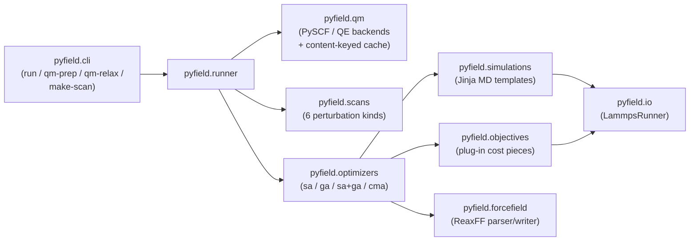

# PyField

PyField is a Python tool for refitting classical molecular-dynamics force
fields against quantum-chemistry reference data. It optimises ReaxFF
parameters by repeatedly running LAMMPS simulations and minimising a
weighted sum of objectives (energies, charges, structural agreement,
trajectory observables) defined in a single YAML config.

Supported today:

- **Force fields**: ReaxFF.
- **Optimisers**: simulated annealing (`sa`), genetic algorithm (`ga`),
  hybrid (`sa+ga`), CMA-ES (`cma`).
- **Simulation backends**: `minimize`, `nvt`, `npt`, `single_point`,
  plus a user-supplied Jinja template escape hatch.
- **Objectives**: energy combinations, per-atom QEq charges,
  coordination number, structural matching (Kabsch RMSD / bond
  lengths / bond angles), RDF peak position, force matching,
  melting-onset temperature (multi-NVT), bulk modulus (multi-NPT).
- **Platforms**: Linux x86_64/aarch64, macOS, WSL2.

## Table of Contents

- [Architecture](#architecture)
- [Installation](#installation)
- [Examples](#examples)
- [Features](#features)
- [Citation](#citation)
- [License](#license)

## Architecture

PyField is a `pyfield/` Python package. At a glance:



The pieces:

- **`pyfield.forcefield`** — parser/writer for force-field files.
  Currently ReaxFF (`REAX_FF`); the `ForceField` base is shaped for
  COMB / Tersoff / OPLS subclasses to slot in later.
- **`pyfield.config`** — pydantic schema, YAML loader, and a deprecation
  shim that converts the pre-Phase-1 text formats into the new schema.
- **`pyfield.simulations`** — Jinja-templated simulation backends.
  Ships `minimize`, `nvt`, `npt`, and `single_point`, plus a
  user-template escape hatch (`template:`) for non-standard runs
  (validated against the variable-leakage contract — the user template
  must reference `{{ FFIELD_PATH }}` exactly once and let the runner
  inject everything the optimiser tunes).
- **`pyfield.objectives`** — registry of cost-function pieces. Ships
  `energy_combination`, `charges`, `coordination`, `structural_match`
  (Kabsch RMSD / `bond_lengths` / `angles`), `rdf_peak`, `forces`,
  `melting_onset`, and `eos`. Adding a new objective is one new file
  under this directory; the schema is untouched.
- **`pyfield.optimizers`** — drivers that consume the objective
  registry. `sa` (simulated annealing), `ga` (genetic algorithm with
  tournament selection / single-point crossover / Gaussian mutation /
  elitism), `sa+ga` (GA with per-child SA refinement), and `cma`
  (CMA-ES via the `cma` package — adapts the per-direction step size
  + covariance from each generation's best samples). All four share
  the parallel `BatchEvaluator` so candidate evaluation is
  embarrassingly parallel across worker processes.
- **`pyfield.io`** — structure-file writer, the long-lived
  `LammpsRunner` (one LAMMPS instance reused across simulations with
  `clear` between), and a streaming `read_dump` + xyz reader for
  trajectory objectives.
- **`pyfield.qm`** — the `pyfield qm-prep` and `pyfield qm-relax`
  subcommands and their pluggable QM backends. `single_point` +
  `relax` cover every registered objective. PySCF backend ships
  today; xTB / QE / GPAW / ORCA / CP2K slot in behind the same
  interface (one new file each).
- **`pyfield.scans`** — the `pyfield make-scan` engine. Six geometric
  perturbations (bond stretch, angle bend, dihedral, atom
  displacement, dimer separation, isotropic scale); each scan kind is
  one small function under `pyfield/scans/transforms.py`.
- **`pyfield.viz`** — `animate_xyz_dir` for previewing scans in a
  notebook. Pure matplotlib (no extra deps).

Adding a new objective or simulation type is a new file under the
relevant subpackage — no schema or optimiser edits.

## Installation

Quickstart (Linux / macOS, Python ≥ 3.8):

```bash
python -m venv .venv && source .venv/bin/activate
pip install 'lammps[mpi]'
pip install -e .
pyfield run tests/cl2.yaml
```

This installs PyField as an editable package, registers the `pyfield`
CLI on your PATH, and runs the Cl₂ ReaxFF smoke optimisation against
`tests/cl2.yaml` — finishes in well under a second with a
`FINAL cost: 32907.21744068185` line (`seed: 0` is set in the YAML so
the run is bit-reproducible).

The pre-Phase-1 text-format inputs still work via a deprecation shim:

```bash
pyfield run-legacy tests/Trainingfile_2.txt tests/Inputstructurefile.txt \
  --ff tests/ffieldoriginal.txt --params tests/params --out tests/runs/legacy
```

### Setting up Quantum ESPRESSO (optional, for PBC training)

PySCF (the default QM backend) handles cluster training and small PBC
cells well, but its plane-wave PBC gradient infrastructure is fragile
for production-sized supercells. For bulk-property training (elastic
constants, defect formation energies, vacancy migration barriers) we
recommend Quantum ESPRESSO via PyField's `qe` backend. Setup is
three steps.

**1. Install QE.**

```bash
sudo apt install quantum-espresso        # Ubuntu / Debian
# or
conda install -c conda-forge qe           # cross-platform
# or build from source: https://www.quantum-espresso.org/
```

After install, `pw.x` should be on `PATH`. **For any non-trivial cell, you
want MPI** — single-core `pw.x` on an 18-atom GST cell at `ecutwfc=50,
kpts=[2,2,2]` takes ~15 min per BFGS step, which compounds badly with
the 25–30 step relaxes typical for our scan points. With MPI:

```bash
export ESPRESSO_COMMAND='/usr/bin/mpirun.openmpi -np {nproc} pw.x'
```

The `{nproc}` placeholder is substituted **per QE call** by
`pyfield.qm.qe_backend._resolve_command`, picking the minimum of:

- `len(os.sched_getaffinity(0))` — CPUs actually available to this
  process, respecting cgroup / SLURM / taskset, not just host total.
- A **size heuristic**: `2 × n_atoms × n_kpts`. So a 2-atom Γ-only
  test cell gets `-np 4`, not the whole node — beyond that ratio
  MPI comm overhead dwarfs any speedup. An 18-atom 2×2×2-grid GST
  cell heuristic is 288, so it claims everything the system has up
  to ~64 ranks.
- **`qm_max_procs:`** on the structure (per-structure pin) and
  **`qm.max_processes:`** on the qm block (global cap), both
  optional. Specific-wins-over-general: per-structure beats global
  beats heuristic.

Same exported string works on an 8-core laptop and a 64-core node
without re-editing, and right-sizes per call without you having to
think about it. Plain `-np 8` still works if you'd rather pin
explicitly — only the `{nproc}` token is auto-substituted.

The env var is **just the launcher prefix**. ASE 3.23+'s
`EspressoProfile` appends `-in espresso.pwi` and captures
stdout/stderr itself — older docs that include `-in PREFIX.pwi >
PREFIX.pwo` are wrong for the modern Profile API and would be passed
as literal argv to `mpirun`.

Use the **system** OpenMPI launcher (`/usr/bin/mpirun.openmpi`)
explicitly: `pw.x` from `apt install quantum-espresso` is linked
against system OpenMPI (`libmpi.so.40`), and a venv-installed
`mpirun` is often MPICH/Hydra — ABI mismatch would either error or
fork N independent serial processes (no parallelism). Verify with
`ldd $(which pw.x) | grep mpi`.

On 8 cores you'll typically see 5–7× speedup over single-core; on
64 cores expect ~30–40× on bulk relaxes (parallel efficiency drops
past the 8-fold-PW-then-k-point regime). ASE picks up
`ESPRESSO_COMMAND` automatically.

> ⚠️ **Set this before launching `python` or `jupyter`.** ASE
> snapshots the env var when the `EspressoProfile` is constructed.
> Setting `os.environ['ESPRESSO_COMMAND'] = …` from inside an
> already-running notebook kernel is too late for the profile that
> was built at import time — restart the kernel after you export.
> To check what the kernel sees: `import os;
> print(os.environ.get('ESPRESSO_COMMAND'))`. `None` means
> single-core.

**2. Download SSSP pseudopotentials.**

The Standard Solid-State Pseudopotentials (SSSP) library from
Materials Cloud is the recommended pseudopotential set — well-tested
across thousands of compounds. Download the *Efficiency* set (the
*Precision* set works too, just slower):

```bash
mkdir -p ~/qe_pseudos && cd ~/qe_pseudos
curl -fsSL -o SSSP.tar.gz \
  "https://archive.materialscloud.org/api/records/rcyfm-68h65/files/SSSP_1.1.2_PBE_efficiency.tar.gz/content"
tar xzf SSSP.tar.gz && rm SSSP.tar.gz
```

That's ~37 MB compressed → ~100 MB extracted, ~70 UPF files covering
elements 1–83. Set the env var so PyField finds them:

```bash
export ESPRESSO_PSEUDO=~/qe_pseudos
```

**3. Tell PyField about it in the YAML.**

A single `qm:` block can serve both PySCF clusters and QE bulk by
adding QE-specific fields alongside the PySCF ones; per-structure
`qm_code: qe` flips a structure to the QE backend:

```yaml
qm:
  code: pyscf                  # default backend (cluster-style)
  functional: b3lyp
  basis: def2-svp
  cache_dir: runs/qm_cache

  # QE-specific settings, picked up by structures with qm_code: qe
  pseudo_dir: /home/you/qe_pseudos     # or set $ESPRESSO_PSEUDO
  pseudopotentials:
    Ge: ge_pbe_v1.4.uspp.F.UPF
    Sb: sb_pbe_v1.4.uspp.F.UPF
    Te: Te_pbe_v1.uspp.F.UPF
  ecutwfc: 50                  # Ry, orbital cutoff
  ecutrho: 400                 # Ry, density cutoff (≈ 8 × ecutwfc)
  kpts: [2, 2, 2]              # Γ-only (1,1,1) is fine for ≥30-atom supercells

structures:
  GST_rocksalt:
    pbc: true
    qm_code: qe                # → use QE for this structure
    qm_functional: pbe         # PBE for bulk; QE doesn't do hybrid PBC well
    box: [6.02, 6.02, 6.02]
    qm_relax: true             # works reliably under QE
    atoms: [...]
```

The QE cache is content-keyed the same way as PySCF (via
`settings_fingerprint`), so re-running with a tweaked ffield is a
no-op on the QM side. Per-element pseudopotential filenames *do*
matter — change the UPF and the cache invalidates.

**Picking pseudopotential filenames.** SSSP has both norm-conserving
(`*ONCV*`, `*oncvpsp*`), ultrasoft (`*uspp*`, `*rrkjus*`), and PAW
(`*kjpaw*`, `*paw*`) pseudopotentials, mixed across elements. For the
GST drift study (`studies/gst_drift/`), the chosen UPFs are:

- `Ge → ge_pbe_v1.4.uspp.F.UPF` — ultrasoft, GBRV / PSlibrary
- `Sb → sb_pbe_v1.4.uspp.F.UPF` — ultrasoft, GBRV / PSlibrary
- `Te → Te_pbe_v1.uspp.F.UPF`   — ultrasoft, GBRV / PSlibrary

For a different element set, browse the SSSP catalog
(<https://www.materialscloud.org/discover/sssp/table/efficiency>) and
match filenames against `ls ~/qe_pseudos/`.

### Notes on LAMMPS

The PyPI `lammps[mpi]` wheel bundles a manylinux MPICH library at
`<sys.prefix>/lib/libmpi.so.12`. glibc caches `LD_LIBRARY_PATH` at
process start, so PyField's CLI preloads that library with
`RTLD_GLOBAL` before importing `lammps` (see
`pyfield.io.lammps.preload_libmpi`) — you don't need to set any
environment variables yourself. If the wheel doesn't work for your
platform, fall back to conda-forge (`conda install -c conda-forge
lammps`) or build LAMMPS from source with `PKG_REAXFF=on PKG_QEQ=on
BUILD_SHARED_LIBS=on`.

## Examples

Two end-to-end notebooks demonstrate the full pipeline:

- **[`examples/cl2_walkthrough.ipynb`](examples/cl2_walkthrough.ipynb)**
  — minimal Cl₂ refit with a `bond_stretch` scan (`relax_method: rigid`,
  fine for diatomics). Best entry point. ~45 s.
- **[`examples/water_walkthrough.ipynb`](examples/water_walkthrough.ipynb)**
  — full water (H/O) refit driven by four `relaxed_constrained` scans:
  O–H bond stretch, H–O–H angle bend, water-dimer O…O separation, and
  the explicit H…O hydrogen-bond distance scan. Uses
  `tests/ffield.reax.HO` (Chenoweth/van Duin/Goddard 2008) as the
  starting force field and `tests/params_HO` to select 11 trainable
  parameters. **Heavy demo — excluded from the default `pytest`
  collection**; run it manually:

  ```bash
  pytest examples/water_walkthrough.ipynb --nbmake --nbmake-timeout=1800
  ```

  First run takes ~25 min cold (16 constrained DFT relaxes); warm
  cache re-runs are ~6–10 min (parallel SA over 23 LAMMPS sims is the
  bottleneck once QM is cached).

The Cl₂ notebook is a regression test (`pytest examples/` re-executes
every cell).
The shorter `tests/cl2.yaml` is also runnable directly without the
notebook: `pyfield run tests/cl2.yaml` finishes in well under a second.

### Generating QM training data

The full pipeline starts from a rough geometry guess plus a perturbation
grid; everything else is filled in for you:

```bash
pip install -e .[qm]                                          # pyscf + geometric

pyfield qm-relax  tests/cl2_scan.yaml          -o cl2.relaxed.yaml
pyfield make-scan cl2.relaxed.yaml             -o cl2.scanned.yaml \
                                               --xyz-dir runs/scan_xyz
pyfield qm-prep   cl2.scanned.yaml             -o cl2.populated.yaml
pyfield run       cl2.populated.yaml
```

Step by step:

- **`qm-relax`** runs PySCF geom-opt for every structure flagged
  `qm_relax: true` and writes the relaxed coordinates back into the
  YAML's `atoms:` block. Skip it if you already know the equilibrium
  geometry.
- **`make-scan`** consumes a top-level `scans:` block and stamps out N
  perturbed structures + N matching simulations + N
  `energy_combination` targets (`Scan_i − reference`, with
  `target: { from: dft }` waiting for `qm-prep`). Six scan kinds:
  `bond_stretch`, `angle_bend`, `dihedral`, `atom_displacement`,
  `dimer_separation`, `isotropic_scale`. Each generated structure also
  lands as an `.xyz` under `--xyz-dir` so you can inspect them in
  OVITO — or animate them inline (see below).

  Each scan picks `relax_method`:
  - `rigid` (default) — single-point at the perturbed geometry on both
    QM and FF sides. Fine for diatomics or any system with no internal
    DOFs to relax.
  - `relaxed_constrained` — the reaction coordinate (distance / angle
    / dihedral / dimer-anchor distance / strain) is held fixed; QM
    does a constrained geom-opt (geomeTRIC `$set` for internal
    coordinates, locked-cell PBC relax for strain), FF does `minimize`
    with `fix restrain` for internal coordinates or with the cell held
    fixed for strain. Required for any polyatomic / bulk system where
    other DOFs reorganize as you stretch / bend / strain.

  Optional `ff_relax_method` overrides the FF side independently. Useful
  during early-fit when the seed FF can't yet stably minimize the cells
  (atoms NaN, cell explodes), but you still want QM to do
  `relaxed_constrained`. Set `ff_relax_method: rigid` and the FF will be
  evaluated as a `single_point` at the QM-relaxed geometry, while QM
  still does the full constrained relax. Drop the override once CMA
  produces an FF that can handle minimization.

  **Periodic vs cluster.** Set `pbc: true` on a structure to flip the
  QM backend into periodic mode (`pyscf.pbc.gto.Cell` with Γ-only k
  sampling); the `box: [a, b, c]` field becomes the orthorhombic
  lattice vectors. Cluster mode is the default (a non-interacting
  bounding box). Both can coexist in the same training set —
  `make-scan` dispatches per-structure.

  **Atom replacement (substitution).** Intentionally *not* a scan
  kind. A substitution isn't a continuous coordinate — it's an
  enumeration of distinct compositions. The clean way to train against
  substitution energies is to hand-type each substituted structure as
  a separate `structures:` entry and add `energy_combination` targets
  comparing it to the un-substituted baseline (`{ from: dft }` filled
  in by `qm-prep`). Symmetry-distinct sites depend on the host
  structure; automating that requires crystal symmetry analysis we'd
  rather not bake into the scan grammar.

  Per-scan `legs` and `anchors` declare which atoms move *as a rigid
  group* with each anchor during the perturbation step (e.g. when
  bending a Si–O–Si angle, the M's attached to each Si rotate with
  their Si rather than staying fixed — the natural starting geometry
  for the constrained relax that follows).
- **`qm-prep`** fills every `target: { from: dft }` slot via the
  configured QM backend. Hand-typed targets (empirical or experimental
  numbers) pass through untouched, so DFT-driven and hand-typed targets
  can coexist in one config.
- **`pyfield run`** does the SA / GA refit on the fully populated
  config.

Currently uses **PySCF** (pip-installable, no licence portal); xTB,
Quantum ESPRESSO, GPAW, ORCA, and CP2K backends slot in behind the same
interface (one new file each). Commercial codes — Gaussian, VASP,
Molpro — are intentionally not bundled.

The QM cache is content-keyed (`qm_cache/<sha256>/`), so re-running any
step after only FF-side edits is a no-op.

#### `scans:` schema

```yaml
scans:
  # Diatomic — no substituents to drag along; rigid is fine.
  - type: bond_stretch
    reference: Cl2_Opt
    atoms: [1, 2]
    values: [1.6, 1.9, 2.2, 2.5, 3.0]
    name_prefix: Cl2_d

  # Bulk — strain scan on a periodic crystal cell (PBC). The box is
  # locked at the strained values and atoms relax inside. Five modes:
  # hydrostatic, uniaxial(axis), biaxial(plane), shear(plane).
  - type: strain
    reference: GST_rocksalt          # structure must have `pbc: true`
    mode: uniaxial
    axis: z
    values: [-0.04, -0.02, 0, 0.02, 0.04]
    relax_method: relaxed_constrained
    name_prefix: GST_uni_z

  # Polyatomic — relaxed_constrained + legs so the substituents on
  # each anchor rotate WITH it during the perturbation. QM then
  # relaxes everything else with the angle held at the scan value.
  - type: angle_bend
    reference: SiOSi_Opt
    atoms: [3, 1, 4]                # i=Si1, j=O (vertex), k=Si2
    legs:
      i: [5]                        # M1 attached to Si1 rotates with it
      k: [6]                        # M2 attached to Si2 rotates with it
    range: [80, 130, 11]            # degrees
    relax_method: relaxed_constrained
    name_prefix: SiOSi_a

  - type: dihedral
    reference: H2O2_Opt
    atoms: [1, 2, 3, 4]
    legs: { l: [4] }                # only the second H rotates
    range: [-180, 180, 13]          # degrees
    relax_method: relaxed_constrained
    name_prefix: H2O2_t

  # Dimer separation — anchor atoms drive the constraint, fragments
  # ride along rigidly during perturbation, QM relaxes them after.
  - type: dimer_separation
    reference: Si2OH8_Opt
    anchors: [1, 6]                 # the two Si atoms
    fragments:
      - [2, 3, 4, 5]                # OHs of fragment 1 (Si1 implicit)
      - [7, 8, 9, 10]               # OHs of fragment 2
    values: [3.5, 4.0, 5.0, 6.0]
    relax_method: relaxed_constrained
    name_prefix: SiOH4_dim

  - type: atom_displacement
    reference: Slab_Opt
    atom: 5
    direction: [0, 0, 1]
    range: [-0.5, 0.5, 11]
    name_prefix: Slab_z

  - type: isotropic_scale
    reference: Cell_Opt
    range: [0.95, 1.05, 11]         # multiplier on box+atoms
    name_prefix: Cell_s
```

Pick exactly one of `values:` (explicit list) or `range: [start, stop,
num]` (linspace) per scan. Atom indices are 1-based.

`relax_method: rigid` (default) is right for any scan with no internal
DOFs to relax (diatomics, fixed cells). `relax_method:
relaxed_constrained` is the physically correct choice for polyatomics
— QM `geomeTRIC $set` constraint + FF `fix restrain` at the matching
distance / angle / dihedral / anchor-anchor distance.

#### Visualising scans inline

`pyfield.viz.animate_xyz_dir(path)` reads every `.xyz` in a directory,
builds a 3D-scatter `matplotlib` animation (atoms coloured by element),
and embeds the play/slider widget in the notebook:

```python
from pyfield.viz import animate_xyz_dir
animate_xyz_dir('runs/scan_xyz', pattern='Cl2_d_*.xyz', interval_ms=400)
```

Use it to confirm perturbations look the way you intended *before*
paying for QM. Pure matplotlib — no extra deps.

A minimal user-facing schema looks like:

```yaml
forcefield:
  path: ffield.reax
  type: reaxff
  params: params

structures:
  Cl2_Opt:
    box: [100, 100, 100]
    atoms:
      - { element: Cl, x: 0, y: 0, z: -1.028 }
      - { element: Cl, x: 0, y: 0, z:  1.028 }

simulations:
  Cl2_Opt_min:
    structure: Cl2_Opt
    type: minimize
    restraints: ["bond 1 2 2000 2000 2.056"]

  # An NVT trajectory feeding a coordination objective:
  SiOH4_300K:
    structure: SiOH4
    type: nvt
    temperature: 300
    steps: 200000
    sample_every: 100

  # Power-user escape hatch — any LAMMPS-native run:
  Custom:
    structure: SiOH4
    template: lammps_inputs/explosion.in.j2
    variables: { TEMP: 2500, SEED: 42 }

targets:
  - kind: energy_combination
    weight: 1.0
    terms: { Cl2_414_min: +1, Cl2_Opt_min: -1 }
    target: 81.394           # ΔE in kcal/mol

  - kind: coordination
    weight: 2.0
    simulation: SiOH4_300K
    central: Si
    neighbor: O
    cutoff: 2.5
    target: 4.0

  - kind: structural_match
    weight: 5.0
    simulation: SiOH4_min
    reference: structures/SiOH4_dft.xyz
    metric: rmsd

optimizer:
  method: sa                 # or ga, sa+ga
  T: 0.2
  T_min: 0.1
  alpha: 0.5
  max_iter: 2
  number_of_points: 1
  seed: 0

output:
  dir: runs/my_refit
```

## Features

- One YAML config drives everything (no separate Trainingfile.txt /
  Inputstructurefile.txt).
- Pydantic-validated schema with cross-reference checks (every
  simulation references a known structure; every target references
  known simulations).
- Plug-in objective registry — adding `coordination`, `rdf_peak`, etc.
  is one new file, no schema edit.
- Long-lived LAMMPS instance with `clear` between simulations
  (faster than spawning a fresh `lammps()` per call).
- **Parallel cost evaluation** (`optimizer.parallel: true`,
  `optimizer.processors: N`). Each `ProcessPoolExecutor` worker holds
  its own long-lived `LammpsRunner` and per-worker scratch directory
  (so `*.data` / `*.in` / `*.lammpstrj` files don't collide). SA
  evaluates `number_of_points` walker candidates per cooling step in
  one batch; GA evaluates the whole population per generation;
  `sa+ga` runs each child's SA refinement on its own worker. With
  `optimizer.seed` set, the run is bit-identical regardless of worker
  count — every random number is drawn on the master.
- **`tqdm` progress bar** showing iteration / generation, current
  best cost, and current temperature; auto-suppressed when stderr is
  not a tty (CI).
- Bit-reproducible runs via `optimizer.seed`.
- Single-MD-feeds-many-objectives via simulation deduplication in the
  cost-evaluation loop.
- Jinja escape hatch for power users with non-standard LAMMPS recipes,
  validated against a variable-leakage contract.

## Citation

A peer-reviewed publication is in preparation. Until then, please cite
this repository:

```
PyField: a Python force-field optimisation tool.
https://github.com/sarashs/Python-forcefield-optimizer
```

## License

GPL-2.0-or-later (matching the bundled LAMMPS dependencies).
